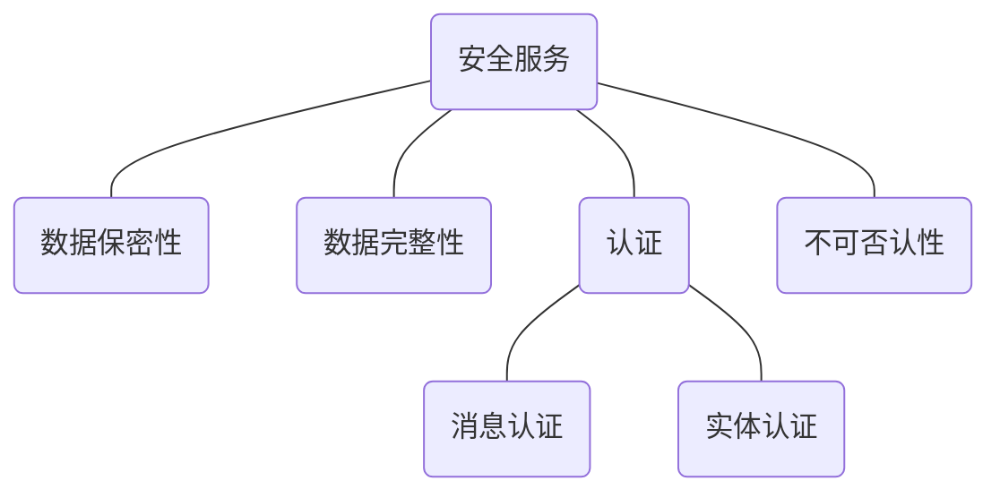

<style>
    .crisp-client, #vcomments {
        display: none;
    }
</style>

本课程的参考教材为《密码编码学与网络安全：原理与实践》，👉 [英文影印版](course/cryptography/cryptography-and-network-security_principles-and-practice-7th-global-edition.pdf ':ignore')（第七版）。

<!-- tabs:start -->

### ** 🔬 实验 **

> 实验每周一次，QQ 屏幕共享给老师进行验收

#### 🔬 实验一

?> Many Time Pad

<details>
<summary>实验内容</summary>

> 【时间】 5 月 23 号（周六）晚上
> 
> 【编程语言】 Python（推荐）或者 C/C++
> 
> 【实验目的】
> 
> 1. 了解流密码的结构特点；
> 2. 掌握 One-time Pad 的一般具体实现；
> 3. 通过使用 Python（推荐）或者 C，编程实现一个流密码加密示例的破解，进一步认识在流密码加密中多次使用相同密钥导致的问题。
> 
> 【实验内容】
> 
> 在掌握流密码结构的基础上，通过本实验观察使用相同流密码密钥加密多个明文导致的严重后果。
> 
> 附件 [ciphertext.txt](course/cryptography/lab-1-ciphertext.txt ':ignore') 有 11 个十六进制编码的密文，它们是使用流密码加密 11 个明文的结果，所有密文都使用相同的流密码密钥。
> 
> 实验的目标是解密最后一个密文，并提交明文消息。
> 
>   
> 提示：
> 
> 1. 对密文进行异或，并考虑当空格与 [a ~ z, A ~ Z] 中的字符进行异或时会发生什么。
> 2. 附件 [encrypt.py](course/cryptography/lab-1-encrypt.py ':ignore') 是用于生成密文的 Python 示例程序（不影响实验，仅供参考）。 

</details>

- [实验报告](course/cryptography/lab-1.md)

#### 🔬 实验二

?> 离散对数求解

<details>
<summary>实验内容</summary>

> 【时间】5 月 30 号（周六）晚上
> 
> 【编程语言】Python（推荐）或者 C/C++
> 
> 【实验目的】
> 
> 1. 掌握与密码学相关的基础数论知识；
> 2. 通过使用 Python（推荐）或者 C，利用中间相遇攻击来编程实
>  
> 【实验内容】
> 实验内容和要求请见附件 [EXP2-Doc.pdf](course/cryptography/lab-2-EXP2-Doc.pdf ':ignore')
> 
> ```pdf
> course/cryptography/lab-2-EXP2-Doc.pdf
> ```

<!-- <font color=gray>docsify 的文档嵌入（嵌入多个 iframe）还有一点问题，修复 bug 前先使用 docsify-pdf-embed 插件来显示 </font> -->

</details>

- [实验报告](course/cryptography/lab-2.md)

#### 🔬 实验三

?> CBC 和 CTR 模式下的 AES

<details>
<summary>实验内容</summary>

> 【时间】6 月 6 号（周六）晚上
> 
> 【地点】待定
> 
> 【编程语言】Python（推荐）或者 C/C++
> 
> 【实验目的】
> 1. 了解分组密码的结构特点；
> 2. 掌握传统分组密码结构 AES，以及 AES 在两种工作模式 CBC 和 CTR 下的实现；
> 3. 通过使用 Python（推荐）或者 C，编程分别实现 CBC 和 CTR 模式下的 AES 加密解密。
> 
> 【实验内容】
> 
> 在本次实验中，需要实现两个加密/解密系统，一个在密文分组链接模式（CBC）下使用 AES，另一个在计数器模式（CTR）中使用 AES。
> 
> 完成程序后，使用附件的 [test.txt](course/cryptography/lab-3-test.txt ':ignore') 中给出的四组密钥和密文（十六进制形式）来验证你的代码。
> 
> 【要求】：
> 1. 在两种模式下，16 字节的加密 IV 都要求是随机生成的，并被添加到密文前面；
> 2. 对于 CBC 加密，要求使用 PKCS5 填充方案；
> 3. 对于 AES 的基本实现，你可以使用现有的加密库，如 PyCrypto（Python），Crypto++（C++）或任何其他语言和库；
> 4. 要求自己实现 CBC 和 CTR 模式，而不是直接调用 AES 库的内置功能；

</details>

- [实验报告](course/cryptography/lab-3.md)

#### 🔬 实验四

?> RSA 中公开的模数 N

<details>
<summary>实验内容</summary>

> 【时间】6 月 13 号（周六）晚上
> 
> 【地点】待定
> 
> 【编程语言】Python（推荐）或者 C/C++
>
> 【实验目的】
> 1. 了解公钥加密方案的一般结构；
> 2. 深入理解 RSA 加密原语的密钥生成；
> 3. 通过使用 Python（推荐）或者 C，编程实现对没有正确生成密钥的 RSA 的破解，提醒大家不要尝试自己随意实现加密原语。
>
> 【实验内容】
> 实验内容和要求请见附件 [EXP4-Doc.pdf](course/cryptography/lab-4-EXP4-Doc.pdf ':ignore')
>
> ```pdf
> course/cryptography/lab-4-EXP4-Doc.pdf
> ```

</details>

- [实验报告](course/cryptography/lab-4.md)

#### 🔬 实验五

?> 视频大文件验证

<details>
<summary>实验内容</summary>

> 【时间】6 月 20 号（周六）晚上
> 
> 【地点】待定
> 
> 【编程语言】Python（推荐）或者 C/C++
>
> 【实验目的】
> 1. 掌握数据完整性、哈希函数、MAC 等概念；
> 2. 了解如何使用 MAC 来确保数据的完整性；
> 3. 通过使用 Python（推荐）或者 C，利用 SHA-256 对视频大文件进行认证，学习如何使用哈希链来的实现大文件的分块认证。
>
> 【实验内容】
> 实验内容和要求请见附件 [EXP5-Doc.pdf](course/cryptography/lab-5-EXP5-Doc.pdf ':ignore')
>
> ```pdf
> course/cryptography/lab-5-EXP5-Doc.pdf
> ```

</details>

- [实验报告](course/cryptography/lab-5.md)

### ** 💯 复习 **

> 目录是余老师的[各课件](https://github.com/JingqingLin/cryptography)的标题。70% 的期末考试问题来自于课后题，最后一节课的视频在[这里](https://www.eeo.cn/live.php?lessonKey=d19fdb204aa038fe)

课程从”实现四类安全服务“为话题展开讨论：



- [Introduction](course/cryptography/summary-introduction.md "Introduction - 复习 - 现代密码学与应用")
- [Classical Encryption](course/cryptography/summary-classical-encryption.md "Classical Encryption - 复习 - 现代密码学与应用")
- [DES](course/cryptography/summary-des.md "DES - 复习 - 现代密码学与应用")
- [AES](course/cryptography/summary-aes.md "AES - 复习 - 现代密码学与应用")
- [Modes of Operation](course/cryptography/summary-modes-of-operation.md "Modes of Operation - 复习 - 现代密码学与应用")
- [Application of Symemtric Cipher](course/cryptography/summary-application-of-symemtric-cipher.md "Application of Symemtric Cipher - 复习 - 现代密码学与应用")

<!-- tabs:end -->