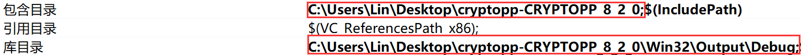

?> CBC 和 CTR 模式下的 AES

## 实验内容

> 【时间】6 月 6 号（周六）晚上
> 
> 【地点】待定
> 
> 【编程语言】Python（推荐）或者 C/C++
> 
> 【实验目的】
> 1. 了解分组密码的结构特点；
> 2. 掌握传统分组密码结构 AES，以及 AES 在两种工作模式 CBC 和 CTR 下的实现；
> 3. 通过使用 Python（推荐）或者 C，编程分别实现 CBC 和 CTR 模式下的 AES 加密解密。
> 
> 【实验内容】
> 
> 在本次实验中，需要实现两个加密/解密系统，一个在密文分组链接模式（CBC）下使用 AES，另一个在计数器模式（CTR）中使用 AES。
> 
> 完成程序后，使用附件的 [test.txt](course/cryptography/lab-3-test.txt ':ignore') 中给出的四组密钥和密文（十六进制形式）来验证你的代码。
> 
> 【要求】：
> 1. 在两种模式下，16 字节的加密 IV 都要求是随机生成的，并被添加到密文前面；
> 2. 对于 CBC 加密，要求使用 PKCS#5 填充方案；
> 3. 对于 AES 的基本实现，你可以使用现有的加密库，如 PyCrypto（Python），Crypto++（C++）或任何其他语言和库；
> 4. 要求自己实现 CBC 和 CTR 模式，而不是直接调用 AES 库的内置功能；

## 实验准备

本实验拟采用 C++ 作为编程语言，并调用 Crypto++ 对 AES 进行基本实现。

> [!TIP]
> Crypto++ 下载地址：https://www.cryptopp.com/#download


由于 Crypto++ 的编译版本是使用 MSVC 构建的，我们用 Visual Studio 打开解决方案 cryptest.sln，并将 cryptlib 设为启动项目，然后按下 <kbd>Ctrl</kbd> + <kbd>B</kbd> 生成 cryptlib。此时路径 `./Win32/Output/Debug` 下会输出 cryptlib.lib 文件。

接着，新建一个项目测试可用性。

首先需要引入头文件和库文件：打开 `项目 - *** 属性 - VC++ 目录`，把 Crypto++ 头文件所在路径和先前输出的库文件路径分别添加到**包含目录**和**库目录**。



然后在属性页的 `链接器 - 输入 - 附加依赖项` 中添加 cryptlib.lib。


最后，在属性页的 `C/C++ - 代码生成 - 运行库` 中选择 `多线程调试（/MTD）`。


运行测试代码：

```cpp
#include <iostream>
#include <aes.h>

using namespace std;
using namespace CryptoPP;

int main()
{
    cout << "Hello Crypto++" << endl;
    cout << "Aes block size is " << AES::BLOCKSIZE << endl;
    return 0;
}
```

并有如下输出：

```
Hello Crypto++
Aes block size is 16
```

> Crypto++ 的安装和使用参考了[这篇文章](https://blog.csdn.net/qq_32261191/article/details/78855651)

## 实验分析

实验要求实现在 CBC 和 CTR 下的 AES，并有如下附加说明：

> [!NOTE]
> 1. 在两种模式下，16 字节的加密 IV 都要求是随机生成的，并被添加到密文前面；
> 2. 对于 CBC 加密，要求使用 PKCS#5 填充方案；
> 3. 对于 AES 的基本实现，你可以使用现有的加密库，如 PyCrypto（Python），Crypto++（C++）或任何其他语言和库；
> 4. 要求自己实现 CBC 和 CTR 模式，而不是直接调用 AES 库的内置功能；

最后，用 [test.txt](course/cryptography/lab-3-test.txt ':ignore') 给出的密钥和密文验证代码。

### 密文分组链接模式（CBC）

CBC 的加解密过程如下：


#### 填充

CBC 是分组密码的一种工作模式，在加密前要对最后一块明文进行填充，实验要求使用 PKCS#5 填充方案。

PKCS#5 是按 8 字节分组对数据进行填充的：如果要填充 1 个字节，那填入的值就是 `0x01`；如果要填充 2 个字节，那么填入的值就是 `0x02`，以此类推。但若待加密数据长度正好为 8 的整数倍时，则需要填入 8 个 `0x08`。

填充示例，分组大小为 8 字节，摘自[这里](https://segmentfault.com/a/1190000019793040)：

```cpp
h<0x07><0x07><0x07><0x07><0x07><0x07><0x07>                 7
he<0x06><0x06><0x06><0x06><0x06><0x06>                      6
hel<0x05><0x05><0x05><0x05><0x05>                           5
hell<0x04><0x04><0x04><0x04>                                4
hello<0x03><0x03><0x03>                                     3
hello <0x02><0x02>                                          2
hello w<0x01>                                               1
hello wo<0x08><0x08><0x08><0x08><0x08><0x08><0x08><0x08>    8
```

实际上，PKCS#5 为 PKCS7 的一个子集（PKCS7 并不限于 8 字节的分组）。由于 AES 按 16 字节大小分组，如果采用 PKCS#5，实质上就是采用 PKCS7。

填充发生在明文加密之前，而解密之后的明文需要**去掉填充**，这个过程可以看作是填充的逆过程。

**去填充过程**：首先我们获取字符串的最后一个字符 `paddingNum`，这个字符一定是填充的值。同时，说明有 `paddingNum` 个字符被填充进去了。我们只需循环地去掉末尾的 `paddingNum` 个字符即可。

<details>
<summary style="font-weight: 600;">加密前的填充代码</summary>

```cpp
string padding(string plaintext)
{
    int len = plaintext.length();
    // 要填充的值。AES::BLOCKSIZE = 16
    int paddingNum = AES::BLOCKSIZE - len % AES::BLOCKSIZE;
    // 明文分组个数
    int quotient = len / AES::BLOCKSIZE;

    // 最后一组
    string lastBlock = plaintext.substr(AES::BLOCKSIZE * quotient, len % AES::BLOCKSIZE);
    for(int i = 0; i < AES::BLOCKSIZE - len % AES::BLOCKSIZE; i++) {
        lastBlock.push_back((unsigned char)paddingNum);
    }

    return plaintext.substr(0, AES::BLOCKSIZE * quotient) + lastBlock;
}
```

</details>

<br>

<details>
<summary style="font-weight: 600;">解密后的去填充代码</summary>

```cpp
// 密文/明文被分为 multiple 组
// 获取解密后的最后一组明文
string lastBlock = plaintext.substr((multiple - 1) * AES::BLOCKSIZE, AES::BLOCKSIZE);
// 从字符串最后一个字符获取填充字符
int paddingNum = (unsigned char)lastBlock[AES::BLOCKSIZE - 1];
// 把填充字符从明文中去掉
for(int i = 0; i < paddingNum; i++) {
    // 若填充字符出现不同，则说明给定密文有误
    if(plaintext.back() != paddingNum) {
        return "Ciphertext is invalid!";
    }
    plaintext.pop_back();
}
```

</details>

#### 代码

最后，根据以上 CBC 的解密过程图和去填充思路可以写出解密代码：

```cpp
string decrypt(string ciphertext, string key, string plaintext)
{
    // 原始 key 为 16 进制形式，需按字节转换为 char
    key = hexToStr(key);
    ciphertext = hexToStr(ciphertext);
    // 密文的前 16 个字节为 vi
    string vi = ciphertext.substr(0, AES::BLOCKSIZE);
    ciphertext = ciphertext.substr(AES::BLOCKSIZE, ciphertext.length() - AES::BLOCKSIZE);
    int multiple = ciphertext.length() / AES::BLOCKSIZE;

    AESDecryption aesDecryptor;
    aesDecryptor.SetKey((byte*)key.c_str(), key.length());

    for(int i = 0; i < multiple; i++) {
        // 分组密文
        string ciphertextBlock = ciphertext.substr(i * AES::BLOCKSIZE, AES::BLOCKSIZE);
        unsigned char outBlock[AES::BLOCKSIZE];
        memset(outBlock, 0, AES::BLOCKSIZE);

        aesDecryptor.ProcessBlock((byte*)ciphertextBlock.c_str(), outBlock);

        // AES 输出结果与上组密文或 vi 异或，得到明文
        for(int j = 0; j < AES::BLOCKSIZE; j++) {
            plaintext.push_back(outBlock[j] ^ (unsigned char)vi[j]);
        }

        vi = ciphertextBlock;
    }

    string lastBlock = plaintext.substr((multiple - 1) * AES::BLOCKSIZE, AES::BLOCKSIZE);
    int paddingNum = (unsigned char)lastBlock[AES::BLOCKSIZE - 1];

    for(int i = 0; i < paddingNum; i++) {
        if(plaintext.back() != paddingNum) {
            return "Ciphertext is invalid!";
        }
        plaintext.pop_back();
    }

    return plaintext;
}
```

加解密完整代码 👉 [传送门](course/cryptography/lab-3-aes-cbc ':target=_blank')

### 计数器模式（CTR）

CTR 的加解密过程如下：


CTR 相较于 CBC 少了填充的过程。另外，CTR 需要维护一个自增的计数器。

<details>
<summary style="font-weight: 600;">计数器的自增代码</summary>

```cpp
string counterIncrement(string counter, int n)
{
    string res = counter;
    int addend = n;

    for(int i = counter.length() - 1; i >= 0; i--) {
        unsigned char tempChar = counter[i];
        // 出现进位
        if((int)tempChar + addend > 255) {
            tempChar = tempChar + addend;
            addend = 1;
        } else {
            tempChar = tempChar + addend;
            addend = 0;
        }
        res[i] = tempChar;
    }
    return res;
}
```

</details>

#### 代码

根据以上 CTR 的解密过程图可以写出解密代码（可根据上方 CBC 修改）：

```cpp
string decrypt(string ciphertext, string key, string plaintext)
{
    key = hexToStr(key);
    ciphertext = hexToStr(ciphertext);
    // 密文的前 16 个字节为计数器的初始值
    string counter = ciphertext.substr(0, AES::BLOCKSIZE);
    ciphertext = ciphertext.substr(AES::BLOCKSIZE, ciphertext.length() - AES::BLOCKSIZE);
    int multiple = ciphertext.length() / AES::BLOCKSIZE;

    AESEncryption aesEncryptor;
    aesEncryptor.SetKey((byte*)key.c_str(), key.length());

    for(int i = 0; i < multiple; i++) {
        string ciphertextBlock = ciphertext.substr(i * AES::BLOCKSIZE, AES::BLOCKSIZE);
        string xorBlock;
        unsigned char outBlock[AES::BLOCKSIZE];
        memset(outBlock, 0, AES::BLOCKSIZE);

        aesEncryptor.ProcessBlock((byte*)counter.c_str(), outBlock);

        // 密文和 AES 加密结果异或，得到明文
        for(int j = 0; j < AES::BLOCKSIZE; j++) {
            xorBlock.push_back(outBlock[j] ^ (unsigned char)ciphertextBlock[j]);
        }

        plaintext += xorBlock;
        // 计数器自增
        counter = counterIncrement(counter, 1);
    }

    // 最后的分组可能不完整，单独输出
    int residueLen = ciphertext.length() - multiple * AES::BLOCKSIZE;
    string residueCiphertext = ciphertext.substr(multiple * AES::BLOCKSIZE, residueLen);
    string xorBlock;
    unsigned char outBlock[AES::BLOCKSIZE];
    memset(outBlock, 0, AES::BLOCKSIZE);

    aesEncryptor.ProcessBlock((byte*)counter.c_str(), outBlock);

    for(int j = 0; j < residueLen; j++) {
        xorBlock.push_back(outBlock[j] ^ (unsigned char)residueCiphertext[j]);
    }

    plaintext += xorBlock;

    return plaintext;
}
```

加解密完整代码 👉 [传送门](course/cryptography/lab-3-aes-ctr ':target=_blank')

## 实验结果

对于 txt 中的测试 1 和测试 2，分别输出：`Basic CBC mode encryption needs padding.` 和 `Our implementation uses rand. IV`。

测试 3 和测试 4，分别输出：`CTR mode lets you build a stream cipher from a block cipher.` 和 `Always avoid the two time pad!`。

> [!TIP]
> Crypto++ 中的 AES 库也内置了包括 CBC 和 CTR 在内的各种模式。此处为直接调用库函数的实现[代码](course/cryptography/lab-3-aes-cbc-and-ctr ':target=_blank')。

<br>

> [!NOTE]
> 参考：
>
> https://www.cnblogs.com/lit10050528/p/4081658.html  
> https://www.cnblogs.com/YZFHKMS-X/p/11829021.html  
> https://www.cryptopp.com/wiki/Advanced_Encryption_Standard  
> https://segmentfault.com/a/1190000019793040