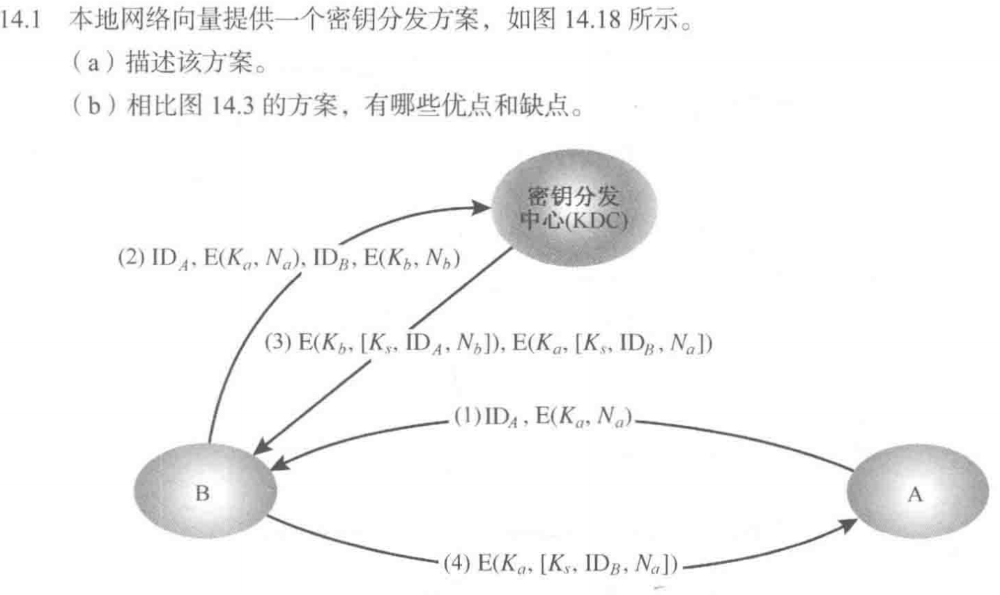
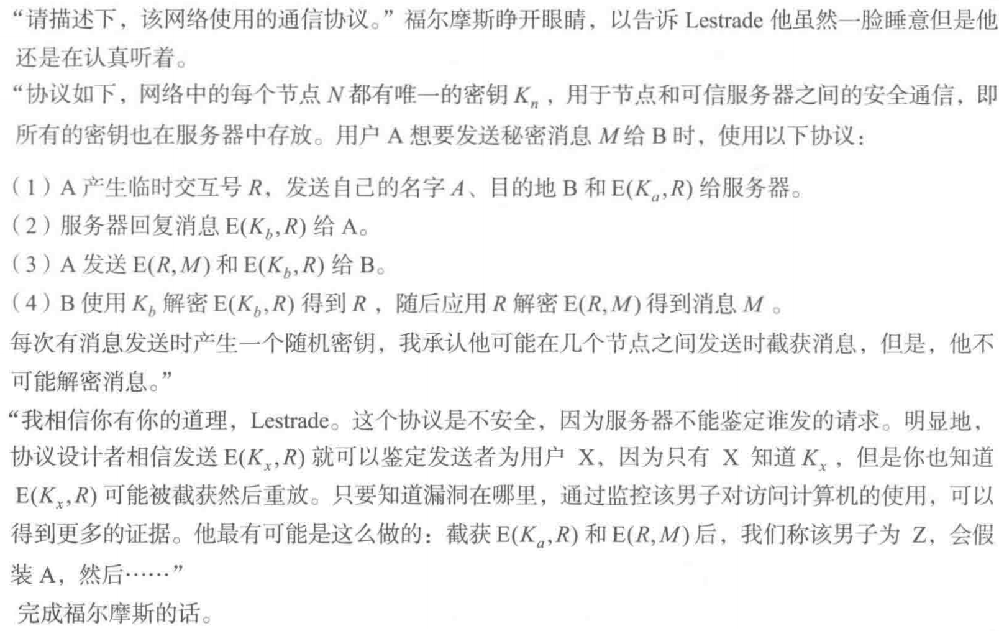

> 教材十五章

- 身份识别的应用场景（强调实时性，登录的时候）
- 认证方式：口令（掌握），挑战/应答（了解），零知识认证协议（**不考**，匿名投票时可用到）
- 这些方式为什么不安全？
- 用哪些信息来证明自己的身份？

## 口令

> 怎么安全存用户口令？

设置读写权限，存储口令的哈希值，加盐（盐值是随机生成的，可防碰撞攻击）

## 挑战/应答

以下方法可用于防止「重放攻击」：
1. 挑战/应答（随机数）：A 想要一个来自 B 的新消息，首先发给 B 一个临时交互号（询问），并要求后面从 B 收到的消息（回复）包含正确的临时交互号值
2. 序列号（开销较大）：为每一个用于认证交互的消息附上一个序列号，只有当新消息的序列号顺序正确时，它才被接受
3. 时间戳

- 基于对称密钥的挑战/应答
  - 第六张课件中有 [NeedHam Schroeder](course/cryptography/summary-application-of-symemtric-cipher?id=needham-schroeder-协议) 以及其改进方案。
- 基于公钥密码的挑战/应答
- 基于数字签名的挑战/应答
  - 站间协议（STS），https://xz.aliyun.com/t/2965 这里有中文描述。下图为无加密版本：
    
  若不加密，可能遭遇交织攻击（PPT P38，让 A 误以为 ta 在和 B 通信，实际上在和 C 通信）

## 一些攻击手段

- 假冒攻击
- 重放攻击
- 交织攻击：一种模拟或其他欺骗行为，包括选择性地组合来自一个或多个先前或同时进行的协议执行（并行会话）的信息
- 反射攻击：反射攻击是一种攻击挑战/应答认证系统的方法，攻击的基本思想是诱使目标为自己的挑战提供答案。是一种交织攻击
- 选择文本攻击

## 思考题

<!-- tabs:start -->

### ** 15.2 **

> 列出三个常用的防止重放攻击的方法。

1. 随机数
2. 序列号（开销较大）
3. 时间戳

### ** 15.4 **

> Kerberos 主要处理什么问题？

假设一个开放的分布式环境，其中工作站上的用户希望访问分布在整个网络中的服务器上的服务。我们希望服务器能够限制对授权用户的访问，并能够对服务请求进行身份验证。在这种环境下，无法信任工作站为网络服务正确识别其用户。

<!-- tabs:end -->

## 习题

<!-- tabs:start -->

### ** 14.1 **

> 

(a) A 向 B 发送一个连接请求，用 A 与 KDC 共享的密钥加密事件标记或 nonce（$N_a$）。如果 B 准备接受连接，它会向 KDC 发送一个会话密钥请求，包括 A 的加密 nonce 加上 B 生成的 nonce（$N_b$），并用 B 与 KDC 共享的密钥加密。KDC 向 B 返回两个加密的块，其中一个块供 B 使用，包括会话密钥、A 的标识符和 B 的 nonce。为 A 准备了一个类似的块，并从 KDC 传递到 B，然后传递给 A。A 和 B 现在已经安全地获得了会话密钥，并且由于这些非连续性，可以确保另一个是可信的。

(b) 该方案的一个优点是，在 B 拒绝连接的情况下，避免了与 KDC 交互的开销。

### ** 14.2 **

> 

1. 向服务器发送源名称 A，目的地名称 Z（他自己的名称）和 $\mathrm{E}(K_{a}, R)$
2. 服务器将通过向 A 发送 $\mathrm{E}(K_{z}, R)$ 进行响应，而 Z 将截获
3. 因为 Z 知道他的密钥 $K_{z}$，所以他可以解密 $\mathrm{E}(K_{z}, R)$，因此可以动用 $R$ 来解密 $\mathrm{E}(R, M)$ 并获得 $M$

### ** 15.10 **

> 在 Kerberos，当 Bob 收到一个来自于 Alice 的票据，如何得知其是否真实？

它包含 Alice 的 ID、Bob 的名字和 KDC-Bob 密钥加密的时间戳。

### ** 15.11 **

> 在 Kerberos，当 Bob 收到一个来自于 Alice 的票据，如何得知其确实来自于 Alice？

它包含由 KDC-Bob 密钥加密的 Alice 的名字。

### ** 15.12 **

> 在 Kerberos，若 Alice 收到一个回复，她如何得知该消息来自于 Bob（且是 Bob 最新的回复）？

它有一个用会话密钥加密的 Nonce（例如，时间戳）。

<!-- tabs:end -->
