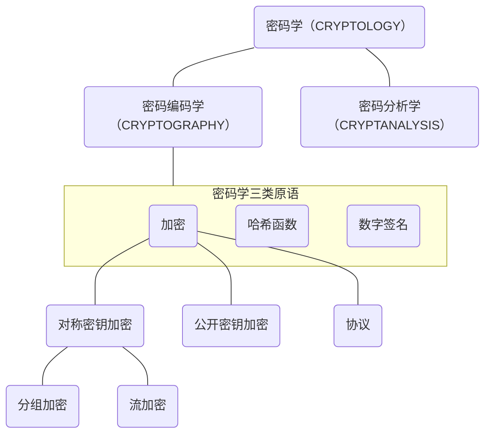
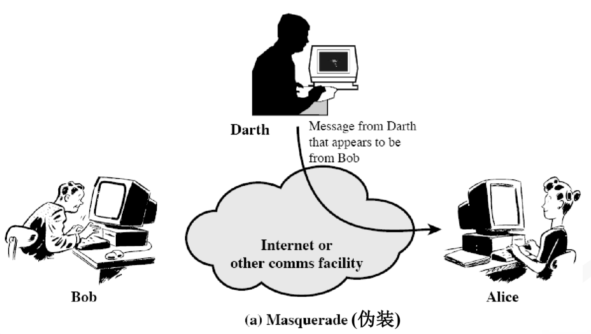
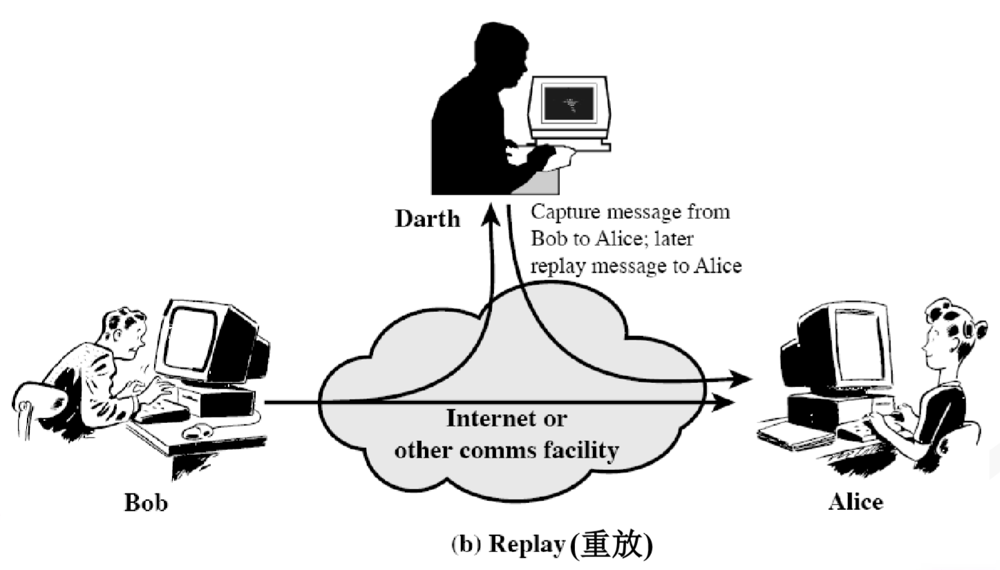
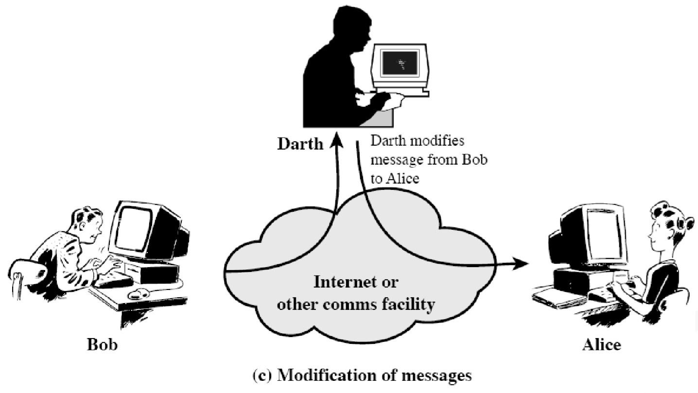
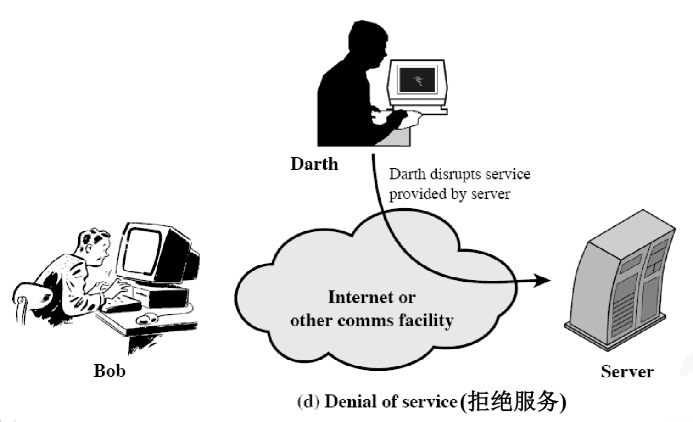
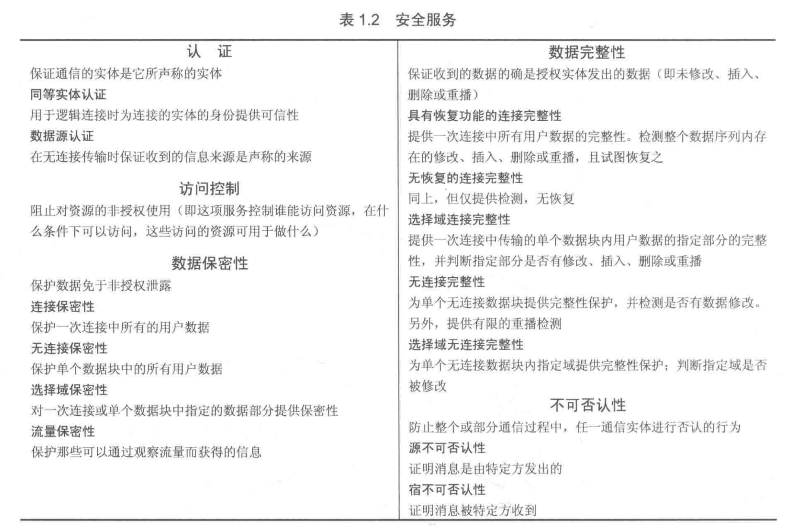

> 教材第一章

OSI 安全架构主要关注安全攻击、安全服务、安全机制。

### 安全攻击

#### 被动攻击

> 对于被动攻击，重点是预防而非检测

- 信息内容泄露
- 流量分析

#### 主动攻击

> 主动攻击难以预防，重点在于检测并从攻击造成的破坏或延迟中恢复过来

<!-- tabs:start -->

##### ** 伪装 **

##### ** 重放 **

##### ** 信息修改 **

##### ** 拒绝服务 **

<!-- tabs:end -->

### 安全服务

**安全服务通过安全机制来实现其安全策略**。X.800 将这些服务分为 5 类共 14 个特定服务（本课对**访问控制**不做要求）：

### 安全机制

课程主要关注以下三种安全机制：
- 加密
- 数字签名：附加于数据单元之后的一种数据，它是对数据单元的密码变换，以使得（如接收方）可证明数据源和完整性，并防止伪造
- 数据完整性

