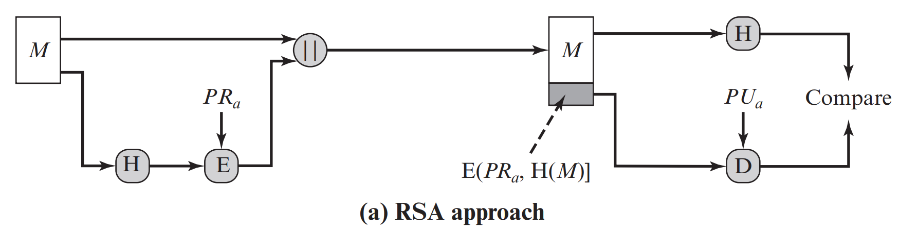
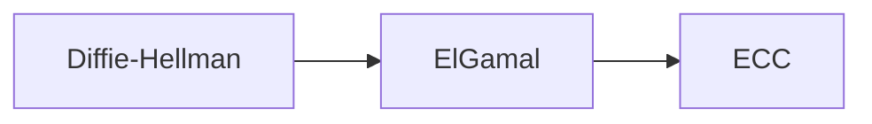
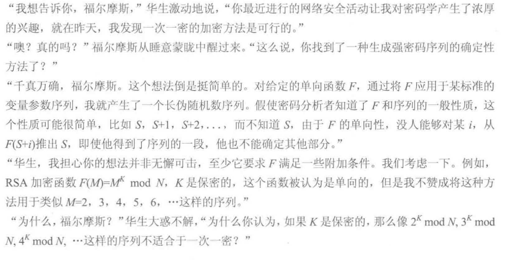
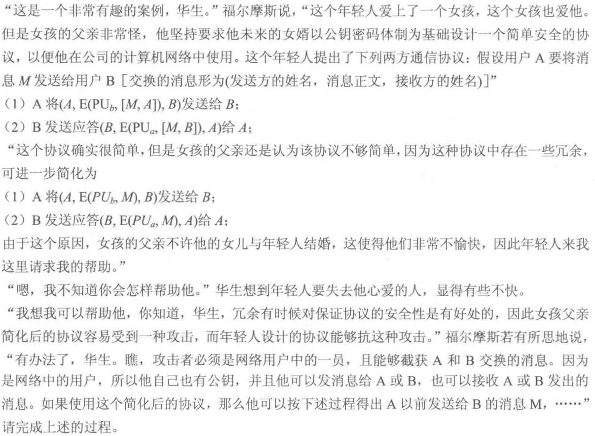
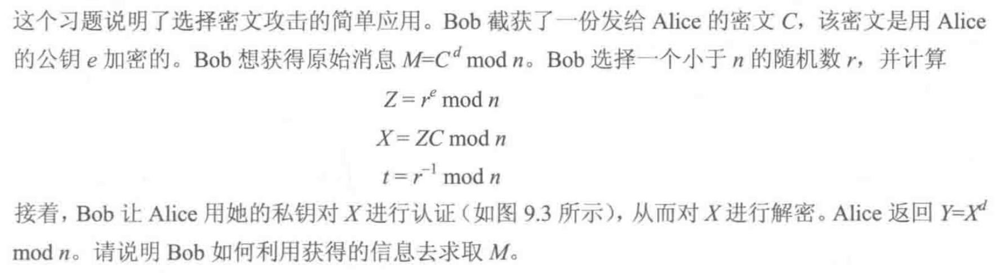

> 教材第九章，第十章，第十四章第三节

## 公钥密码系统原理

1976, the concept of public-key cryptographyis developed by Diffie and Hellman.

- 对称加密比较慢，公钥加密更慢。往往用对称加密保护明文，用公钥加密保护对称密钥
- 公钥加密可解决「不可否认性」问题
- 用途：加/解密（实现数据保密性），**数字签名**（实现认证），**密钥交换**（不是所有的公钥算法都有这三个用途）
- 公钥一般用于加密，验证签名；私钥用于解密，创建签名
- 公钥密码的一些误解和事实：  
  
- 公钥密码体制的应用
  | 算法           | 加/解密 | 数字签名 | 密钥交换 |
  | -------------- | ------- | -------- | -------- |
  | RSA            | ✔️       | ✔️        | ✔️        |
  | 椭圆曲线       | ✔️       | ✔️        | ✔️        |
  | Diffie-Hellman | ❌       | ❌        | ✔️        |
  | DSS            | ❌       | ✔️        | ❌        |
- 对公钥密码的要求（三个容易两个不可行）：
  1. B 产生一对密钥（公钥 $\mathrm{PU}_{b}$，私钥 $\mathrm{PR}_{b}$）在计算上是容易的
  2. 已知公钥和要加密的消息 $M$，发送方 A 产生相应的密文在计算上是容易的
    $$C=\mathrm{E}\left(\mathrm{PU}_{b}, M\right)$$
  3. 接收方 B 使用其私钥对接收的密文解密以恢复明文在计算上是容易的
    $$M=\mathrm{D}\left(\mathrm{PR}_{b}, C\right)=\mathrm{D}\left[\mathrm{PR}_{b}, \mathrm{E}\left(\mathrm{PU}_{b}, M\right)\right]$$
  4. 已知公钥 $\mathrm{PU}_{b}$ 时，攻击者要确定私钥 $\mathrm{PR}_{b}$ 在计算上是不可行的
  5. 已知公钥 $\mathrm{PU}_{b}$ 和密文 $C$，攻击者要恢复明文 $M$ 在计算上是不可行的

## RSA 算法

需要了解：
1. 公钥私钥对怎么生成，加解密怎么做
2. 数学难题是什么
3. 如何提升速率
4. 安全性

#### 公私钥对的生成

- 明文以分组为单位进行加密。在实际应用中，分组的大小是 $i$ 位，其中 $2^{i} < n \leq 2^{i+1}$

#### 数学难题

⭐ 生成大素数是容易的，但是给定一个大数（两个素数的乘积），找出它的因子是困难的。

#### 计算提速

- 模算术里的求幂运算：使用快速幂取模提速
- 选择特定的 $e$
- 使用中国剩余定理加快 $M=C^{d} \bmod n$ 的运算速度（教材 P204，未掌握）
- 使用扩展的欧几里得算法计算 $d$

<!--  -->

#### 安全性

- 一般通过将因子分解的性能作为基准来评价 RSA 的安全性
- 计时攻击类似于窃贼通过观察他人转动保险柜拨号盘的时间长短来猜测密码
- 选择密文攻击见教材 P208

> [!TIP|label:当 RSA 用于数字签名时]
> 

## 密钥管理

> 第十四章第三节

人们已经提出的集中公钥分配方法本质上都可以归结为以下几种方法:
- 公开发布
- 公开可访问目录
- 公钥授权：公钥管理员会成为系统的瓶颈；管理员维护的姓名和公钥的目录也易被篡改
- 公钥证书：无需实时访问公钥授权

## 椭圆曲线密码

!> 椭圆曲线不会考，但是怎么做加法、做乘法需要理解

### ElGamal 密钥体制

- 如果信息必须分组然后以加密的密钥块序列发送，那么每个分块要有唯一的 $k$
- 解密过程中用到了「分数取模」：$a^{p-2} \bmod p = a^{-1} \bmod p$（[费马小定理](https://zh.wikipedia.org/wiki/%E8%B4%B9%E9%A9%AC%E5%B0%8F%E5%AE%9A%E7%90%86)或扩展欧几里得算法。费马小定理只适用于 $p$ 为素数，扩展欧几里得算法在教材 2.3.6）
- ECC 相较于 RSA 有性能上的提升：https://zhuanlan.zhihu.com/p/46143317

## 思考题

<!-- tabs:start -->

### ** 9.1 **

> 公钥密码体制的主要成分是什么？

公钥、私钥、加密算法、解密算法、明文、密文。

### ** 9.2 **

> 公钥和私钥的作用是什么？

私钥可用于加密签名，任何人都可以使用公钥验证签名。公钥可用于加密只能由私钥所有者解密的信息。

### ** 9.3 **

> 公钥密码体制的三种应用是什么？

加/解密，数字签名，密钥交换。

### ** 9.4 **

> 为得到安全算法，公钥密码体制应满足哪些要求？

三个容易两个不可行。在上方 👆。

### ** 9.5 & 9.6**

> 什么是单向函数？

单向函数是将一个定义域映射到一个范围内，使每个函数值都有唯一的逆，条件是函数的计算很简单，而逆的计算是不可行的。

> 什么是单向陷门函数？

单向陷门函数在一个方向上容易计算，而在另一个方向上不可行，除非已知某些附加信息。有了额外的信息，逆可以在多项式时间内计算。

### ** 10.1 **

> 简要说明 Diffie-Hillman 密钥交换。

双方各自创建公私钥对，并将公钥传送给对方。密钥的设计使得双方可以根据各自的私钥和对方的公钥计算出相同的唯一密钥。（它是一种建立秘钥的方法，而不是加密方法）

<!-- tabs:end -->

## 习题

<!-- tabs:start -->

### ** 9.11 **

> 

因为第三项等于第一项的平方；第五项等于第一项乘以第二项……

### ** 9.15 **

> 

1. 敌方 X 拦截了 A 发给 B 的消息，$[A, \mathrm{E}(P U_{b}, M), B]$
2. X 给 B 发送 $[X, \mathrm{E}(PU_{b}, M), B]$
3. B 通过给 X 发送 $[B, \mathrm{E}(PU_{x}, M), X]$ 表示 ta 收到了 X 发送的消息
4. X 使用他的私钥解密 $\mathrm{E}(PU_{x}, M)$，从而得到 $M$

### ** 9.18 **

> 

$e$ 是公钥，$d$ 是私钥。

因为 $Z=r^e \bmod n$，所以 $r = Z^d \bmod n$。Bob 可以算出：

$t Y \bmod n=r^{-1} X^{d} \bmod n=r^{-1} Z^{d} C^{d} \bmod n=C^{d} \bmod n=M$

<!-- tabs:end -->