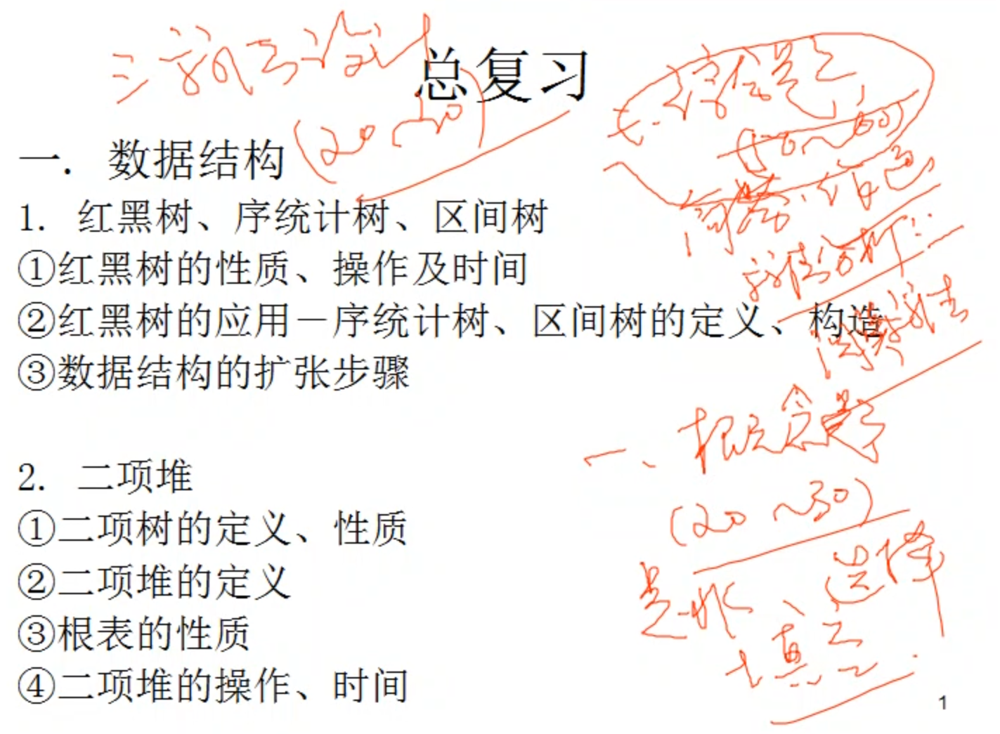
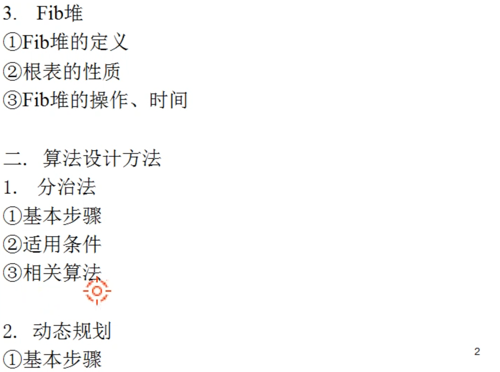
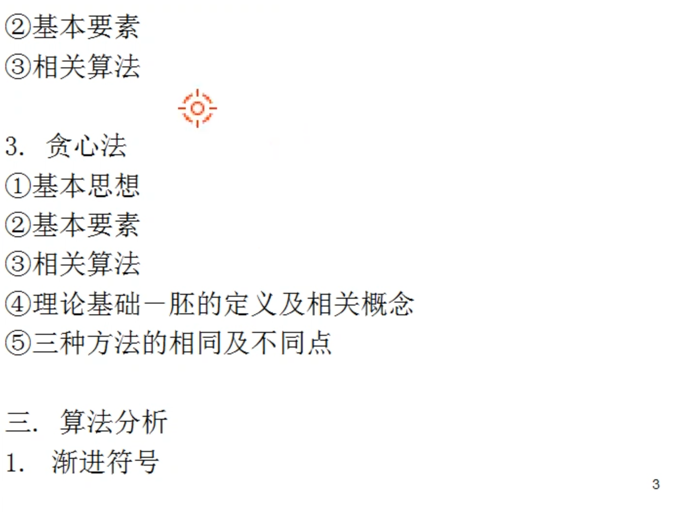
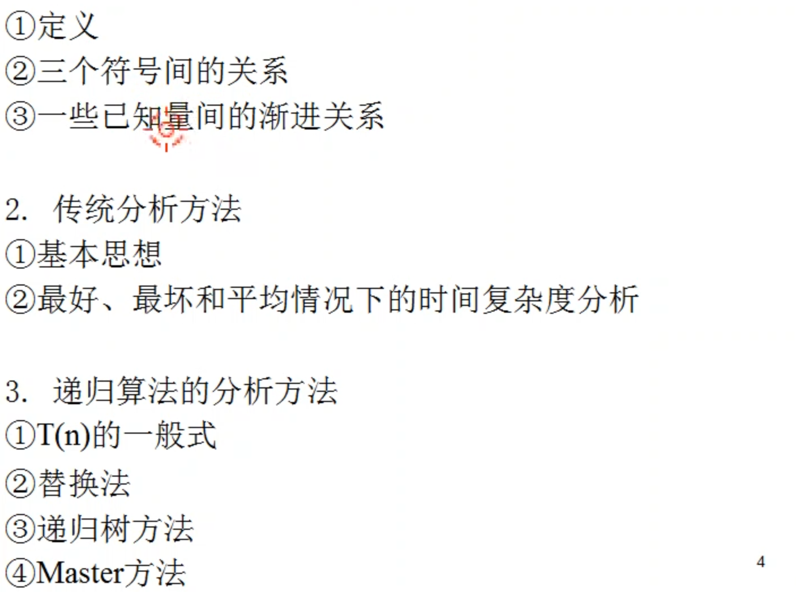
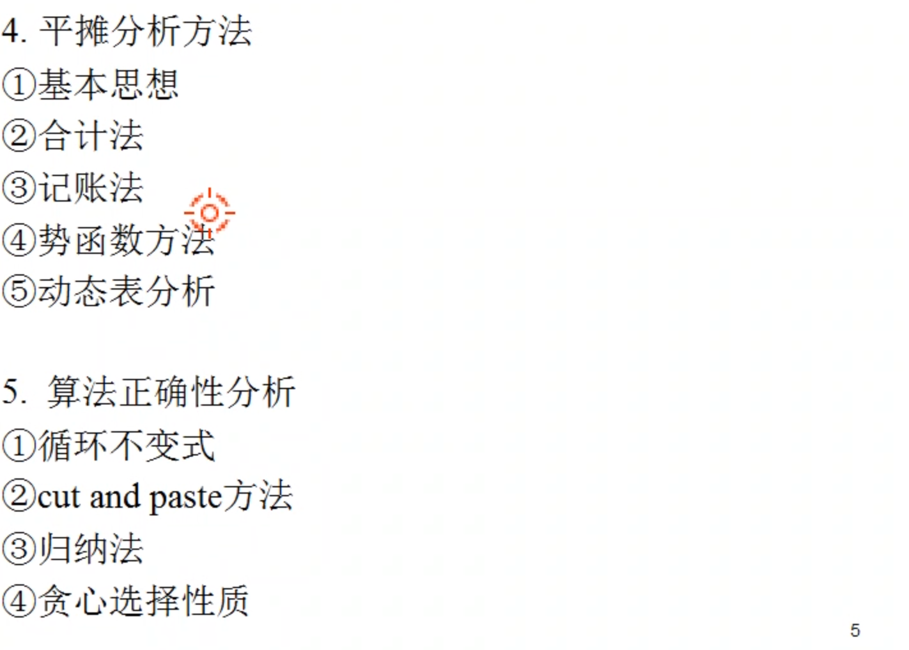
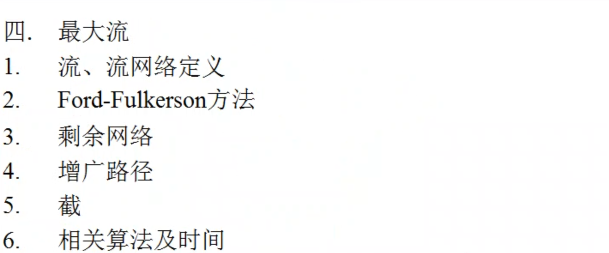

<style>
    .crisp-client, #vcomments {
        display: none;
    }
</style>

本课程使用《算法导论》作为教材，张曙老师上课使用第二版。👉 [英文影印版](course/introduction-to-algorithms/introduction-to-algorithms-3rd.pdf ':ignore')（第三版）。


<!-- tabs:start -->

### ** 🔬 实验 **

> 实验每周一次，只需提交实验报告

#### 🔬 实验一

?> 分治法实验

<details>
<summary>实验内容</summary>

<!-- <iframe src="https://cdn.jsdelivr.net/gh/JingqingLin/Blog/docs/course/introduction-to-algorithms/lab-1-分治法实验.pdf" width="100%" height=500px>
浏览器不支持显示 PDF，请下载：
<a href="https://cdn.jsdelivr.net/gh/JingqingLin/Blog/docs/course/introduction-to-algorithms/lab-1-分治法实验.pdf">下载 PDF</a></iframe> -->

> ```pdf
> course/introduction-to-algorithms/lab-1-分治法实验.pdf
> ```

</details>

- [实验报告](course/introduction-to-algorithms/lab-1.md)

#### 🔬 实验二

?> 典型排序算法训练

<details>
<summary>实验内容</summary>

> ```pdf
> course/introduction-to-algorithms/lab-2-典型排序算法训练.pdf
> ```

</details>

- [实验报告](course/introduction-to-algorithms/lab-2.md)

#### 🔬 实验三

?> 二叉查找树、红黑树的基本操作实现

<details>
<summary>实验内容</summary>

> ```pdf
> course/introduction-to-algorithms/lab-3-二叉查找树、红黑树的基本操作实现.pdf
> ```

</details>

- [实验报告](course/introduction-to-algorithms/lab-3.md)

#### 🔬 实验四

?> 贪心算法实现最佳任务调度实验

<details>
<summary>实验内容</summary>

> ```pdf
> course/introduction-to-algorithms/lab-4-贪心算法实现最佳任务调度实验.pdf
> ```

</details>

- [实验报告](course/introduction-to-algorithms/lab-4.md)

#### 🔬 实验五

?> 0-1 背包问题的算法设计

<details>
<summary>实验内容</summary>

> ```pdf
> course/introduction-to-algorithms/lab-5-0-1-背包问题的算法设计.pdf
> ```

</details>

- [实验报告](course/introduction-to-algorithms/lab-5.md)

### ** 📝 作业 **

> 张曙老师上课使用的教材是《算法导论》第二版，布置的作业也来自第二版。此笔记的答案摘自 [walkccc](https://walkccc.github.io/CLRS/)，为第三版中对应的题目（第三版删去了第二版的某些题目，如果老师刚好布置了那些题，就不在此记录）

- 作业一：2.1-2、2.1-3、2.2-1、3.1-1、3.1-2

- 作业二：2.2-2、2.3-3、2.3-4

- 作业三：4.1-1、4.1-2、4.2-1、4.2-2、<font color=#8590a6>4.3-1、4.3-2（第二版）</font>

- 作业四：7.1-2、7.2-1、7.2-2、7.4-1、7.4-4

- [作业五](course/introduction-to-algorithms/task-5.md)：13.1-2、13.1-5、13.2-3、13.3-1、13.3-2

- [作业六](course/introduction-to-algorithms/task-6.md)：13.4-6、14.1-3、14.2-2、<font color=#8590a6>14.2-3（第二版）</font>

- [作业七](course/introduction-to-algorithms/task-7.md)：14.3-2、15.1-5

- [作业八](course/introduction-to-algorithms/task-8.md)：15.2-1、15.2-2、15.3-1、15.3-2

- [作业九](course/introduction-to-algorithms/task-9.md)：15.4-3、15.5-2、15.5-3

- [作业十](course/introduction-to-algorithms/task-10.md)：16.1-2、16.2-4、16.3-3

- [作业十一](course/introduction-to-algorithms/task-11.md)：16.3-5、16.4-1

- [作业十二](course/introduction-to-algorithms/task-12.md)：16.5-1、16.5-2

- [作业十三](course/introduction-to-algorithms/task-13.md)：17.1-1、17.1-2、17.2-1、17.3-1、17.3-3、17.3-4、17.4-2、17.4-3

- [作业十四](course/introduction-to-algorithms/task-14.md)：<font color=#8590a6>19.1-1、19.1-2、19.2-3、19.2-6（以上均为第二版题号）</font>、19.2-1、19-2.d（思考题）

- [作业十五](course/introduction-to-algorithms/task-15.md)：<font color=#8590a6>26.1-1、26.1-2、26.1-5（以上均为第二版题号）</font>

### ** 💯 复习提纲 **








#### 数据结构

红黑树的插入、删除具体操作不会考，但**时间复杂度**要知道

二项树的定义，二项堆的定义、根表，和斐波那契堆的根表区别，他们的操作、时间

#### 算法设计方法

第二版中动态规划的几个算法案例要清楚，并能以示例求出最优解

贪心中，胚只要掌握相关定义和概念，最优子集、最大独立子集

#### 算法分析

渐近符号：$\Theta$，$\Omicron$，$\Omega$ 的定义

平均情况下的分析不会考

递归算法分析方法要会（可能会指定用什么方法分析，代入法、递归树、主方法）

平摊分析势函数方法要会

正确性分析（循环不变式不考）：寻找最优子结构时用 cut and paste 反证，原来的 cut 掉，新的 paste 上去；归纳法；贪心选择性质

流网络（推送重贴、二分图应用不做要求）

<!-- tabs:end -->
