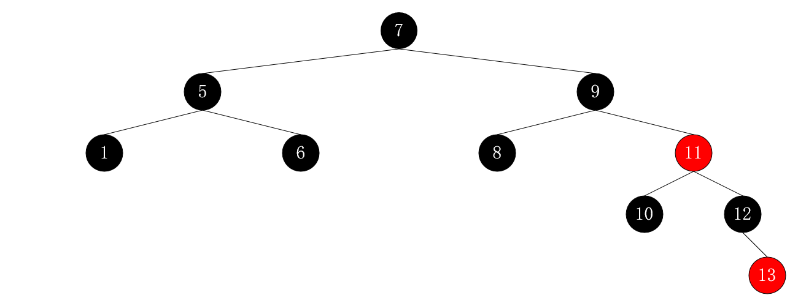
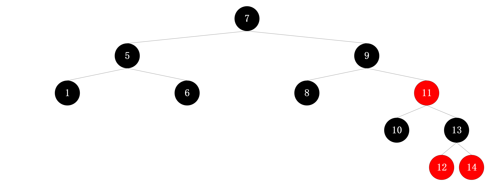
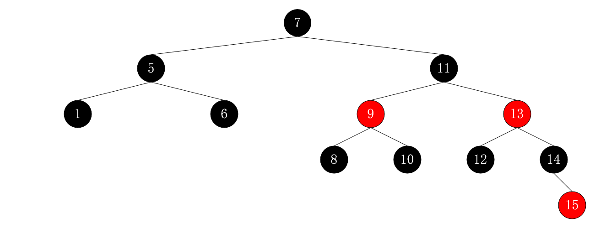

?> 二叉查找树、红黑树的基本操作实现

## 实验要求

> 1. 实现下列关于二叉查找树、红黑树的判断、构建、删除等操作。并写出这些操作的流程图或伪代码
> 2. 请说明二叉查找树和红黑树的区别以及时间、空间性能

## 问题一：验证二叉搜索树

!> [98](https://leetcode-cn.com/problems/validate-binary-search-tree/). 验证二叉搜索树

### 问题描述

给定一个二叉树，判断其是否是一个有效的二叉搜索树。

假设一个二叉搜索树具有如下特征：

- 节点的左子树只包含小于当前节点的数。
- 节点的右子树只包含大于当前节点的数。
- 所有左子树和右子树自身必须也是二叉搜索树。

示例 1:

```
输入:
    2
   / \
  1   3
输出: true
```

示例 2:

```
输入:
    5
   / \
  1   4
     / \
    3   6
输出: false
解释: 输入为: [5,1,4,null,null,3,6]。
     根节点的值为 5 ，但是其右子节点值为 4 。
```

### 解题思路

有两种思路：
1. 根据二叉搜索树中序遍历为升序的特性来判断
2. 递归

中序遍历思路较清晰，此处对“递归法”进行解释。

对于二叉搜索树中某结点，**左子树所有节点小于它；右子树所有结点大于它**。因此递归时，设置两个参数 `upper` 和 `lower` 代表左右子树的数值区间（开区间）。

如何确定区间的值：

- 对左子树进行递归时，`lower` 不变，`upper` 变为当前结点的值
- 对右子树进行递归时，`upper` 不变，`lower` 变为当前结点的值

代码如下：

```java
public static boolean isValidBST(TreeNode root) {
    return recursion(root, Long.MIN_VALUE, Long.MAX_VALUE);
}

public static boolean recursion(TreeNode node, Long lower, Long upper) {
    if (node == null) {
        return true;
    }
    if (node.val <= lower || node.val >= upper) {
        return false;
    }
    if (!recursion(node.right, (long) node.val, upper) || !recursion(node.left, lower, (long) node.val)) {
        return false;
    }
    return true;
}
```

力扣的测试用例中，出现了 Integer 边界值的测试用例（若区间初值为 Integer 的边界值，则对于 `[2147483647]` 会返回 false），所以将左右区间范围改为 Long 的区间。

### 复杂度分析
时间复杂度 : $O(n)$，其中 $n$ 为二叉树的节点个数。在递归调用的时候二叉树的每个节点最多被访问一次。

空间复杂度 : $O(n)$，其中 $n$ 为二叉树的节点个数。递归函数在递归过程中需要为每一层递归函数分配栈空间，所以这里需要额外的空间且该空间取决于递归的深度，即二叉树的高度。最坏情况下二叉树为一条链，树的高度为 $n$ ，递归最深达到 $n$ 层，故最坏情况下空间复杂度为 $O(n)$。

## 问题二：红黑树的构建与删除


### 问题描述
用 `{1，5，6，7，8，9，10，11，12，13，14，15}` 构造一棵红黑树，给出过程以及结果。然后删除顺序为 `{14，9，5}` 的点，也给出过程及结果。

### 流程图

#### 插入

- 插入 $1$:


- 插入 $5$、$6$:


- 插入 $7$、$8$


- 插入 $9$、$10$


- 插入 $11$、$12$


- 插入 $13$



- 插入 $14$



- 插入 $15$



#### 删除

- 删除 $14$:


- 删除 $9$:


### 复杂度分析

红黑树的基本动态集合操作（$\text{SEARCH}$、$\text{PREDECESSOR}$、$\text{SUCCESSOR}$、$\text{MINIMUM}$、$\text{MAXIMUM}$、$\text{INSERT}$ 和 $\text{DELETE}$）时间复杂度为 $O(logn)$