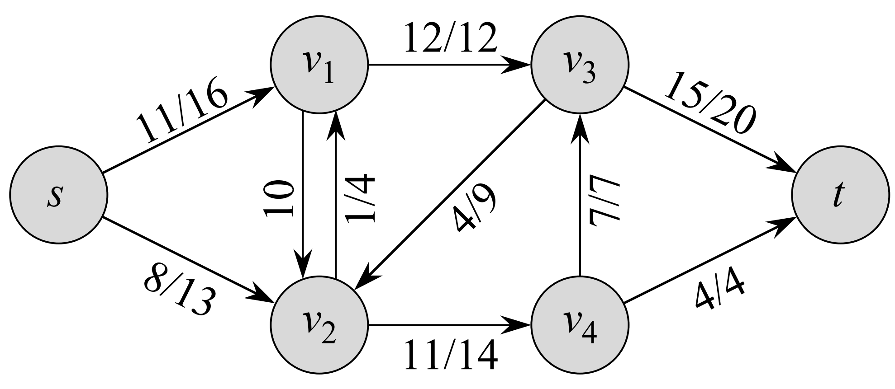

由于本节作业在第三版中无对应题目，以下均为第二版原题。

## 26.1-1

> Using the definition of a flow, prove that if $(u, v) \notin E$ and $(v, u) \notin E$ then $f(u, v) = f(v, u) = 0$.
>
> 利用流的定义，证明如果 $(u, v) \notin E$ 且 $(v, u) \notin E$，有 $f(u, v) = f(v, u) = 0$。

由流的定义可得，若 $(u, v) \notin E$，则 $c(u, v) = 0$。

由流的**容量限制**和**反对称性**得：$f(u, v) \leq c(u, v) = 0$，$f(u, v) = - f(v, u) = 0$，所以 $f(u, v) = f(v, u) = 0$。

## 26.1-2

> Prove that for any vertex $v$ other than the source or sink, the total positive flow entering $v$ must equal the total positive flow leaving $v$.
>
> 证明：对于任意非源点非汇点的顶点 $v$，进入 $v$ 的总正向流必定等于离开 $v$ 的总正向流。

## 26.1-5

> For the flow network $G = (V, E)$ and flow $f$ shown in Figure 26.1(b), find a pair of subsets $X, Y \in V$ for which $f(X, Y) = −f(V − X, Y)$. Then, find a pair of subsets $X, Y \in V$ for which $f(X, Y) = −f(V − X, Y)$.
>
> 