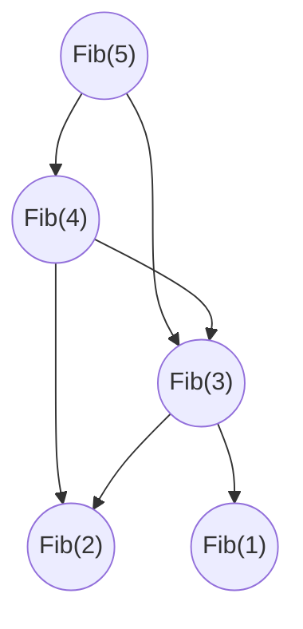

算法导论的作业答案摘自 [walkccc](https://walkccc.github.io/CLRS/)

## 14.3-2

> Rewrite the code for $\text{INTERVAL-SEARCH}$ so that it works properly when all intervals are open.
>
> 改写 $\text{INTERVAL-SEARCH}$ 的代码，使得当所有区间都是开区间时，它也能正确地工作。


```cpp
INTERVAL-SEARCH(T, i)
    x = T.root
    while x != T.nil and i does not overlap x.int
        if x.left != T.nil and x.left.max > i.low
            x = x.left
        else x = x.right
    return x
```


## 15.1-5

!> 老师上课使用的第二版教材中，动态规划的第一个例子是“装配线调度”问题，对应的 [15.1-5](https://cdn.jsdelivr.net/gh/JingqingLin/ImageHosting@master/img/20200515165208.png) 也不相同，以下是第三版的题目

> The Fibonacci numbers are defined by recurrence $\text{(3.22)}$. Give an $O(n)$-time dynamic-programming algorithm to compute the nth Fibonacci number. Draw the subproblem graph. How many vertices and edges are in the graph?
>
> 斐波那契数列可以用递归式 $\text{(3.22)}$ 定义。设计一个 $O(n)$ 时间的动态规划算法计算第 $n$ 个斐波那契数。画出子问题图。图中有多少顶点和边？


```cpp
FIBONACCI(n)
    let fib[0..n] be a new array
    fib[0] = 1
    fib[1] = 1
    for i = 2 to n
        fib[i] = fib[i - 1] + fib[i - 2]
    return fib[n]
```



There are $n + 1$ vertices in the subproblem graph, i.e., $v_0, v_1, \dots, v_n$.

- For $v_0, v_1$, each has $0$ leaving edge.
- For $v_2, v_3, \dots, v_n$, each has $2$ leaving edges.

Thus, there are $2n - 2$ edges in the subproblem graph.