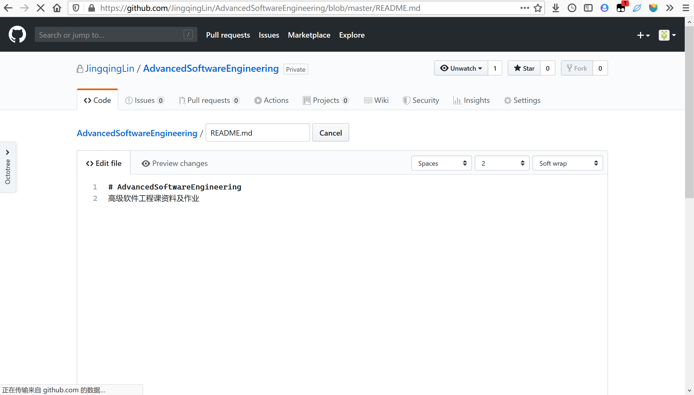
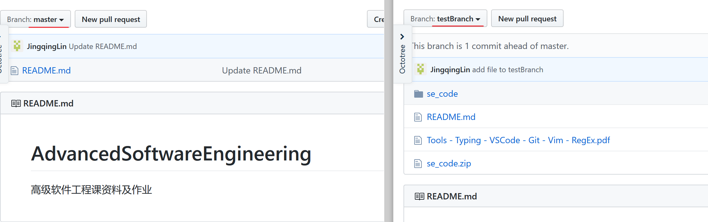

?> 码农的自我修养之必备技能

## git 练习

> 为高软课的资料和作业创建一个 GitHub 仓库，并用 git 命令进行管理

### 创建 GitHub 仓库
首先创建 GitHub 仓库，如下图：

### 克隆到本地
复制网址。

在本地新建文件夹，以此路径打开 cmd 或 PowerShell 并执行命令： `git clone https://github.com/JingqingLin/AdvancedSoftwareEngineering.git`，并在弹出的登录框内登录 GitHub。

### 拉取
> pull 用于取回远程主机某个分支的更新，再与本地的指定分支合并

先在 GitHub 网页上手动对文件进行修改，再在本地执行 `git pull`。

### 分支
> 分支（branch）可以在不影响主线（master）的同时继续工作  
> `git branch` 查看分支  
> `git branch (branchname)` 新建分支  
> `git push origin (branchname)`  推送新分支  
> `git checkout (branchname)` 切换分支

#### 新建分支
执行新建分支命令，并推送。

#### 切换分支
切换到新的分支。

修改本地文件，并推送。推送文件修改需要这几步：
1. 添加需要推送的文件到暂存区
   - `git add .` 监控工作区的状态树，会把工作时的所有变化提交到暂存区，包括文件内容修改和新文件，但不包括被删除的文件
2. 将暂存区里的改动给提交到本地的版本库
   - `git commit -m "add file to testBranch"`
3. 推送
   - `git push origin testBranch`

至此，分支上已经出现了新文件，主线上没有变。

#### 合并分支
接下来合并分支到主线，并推送。对于分支的合并，有 `git merge` 和 `git rebase` 两种方法，区别见[这篇文章](https://www.jianshu.com/p/ca6b2f8f95af)。

这里我使用 `git merge testBranch`。

在网页端创建拉取请求（Create pull request）并合并（Merge pull request）。

此时，主线上也已经更新。

上述操作的网络图如下：

此外，GitHub 开发的 [GitHub Desktop](https://desktop.github.com/) 为 git 提供了图形化界面操作，比命令更加方便。

## vim 练习

用 vi 打开文件。

### 替换
在命令模式下执行 `:%s/Vim/HiVim/g` 替换每一行中所有 Vim 为 HiVim。

修改后如下：

### 注释（替换）
执行 `:1,2s/^/#/g` 对 1 ~ 2 行进行注释，`^` 代表行首插入，`$` 代表行尾插入。

### 多次复制粘贴
使用宏来实现。vim 中的宏实质就是把一个 vim 指令集存到了寄存器中，然后在调用寄存器中的指令。

正常模式（非命令模式）下：
- q + register + 一系列命令 + q
    - register：指用户自己定义的 a - z 中的一个寄存器
    - q + register：开始记录命令
    - q：完成记录，退出记录

1. 将光标移到文本上，键入 `qa` 出现 recording 字样  
   
2. 输入 `2Gy3G4GP`  
   - 2G：光标移至第 2 行
   - y：准备复制
   - 3G：光标移至第 3 行完成复制
   - 4G：光标移至第 4 行
   - P：在当前位置粘贴
3. 输入 `q` 结束录制
4. 输入 `10@a` 执行十次宏

指定行复制命令参考[这里](https://bbs.csdn.net/topics/393565632)