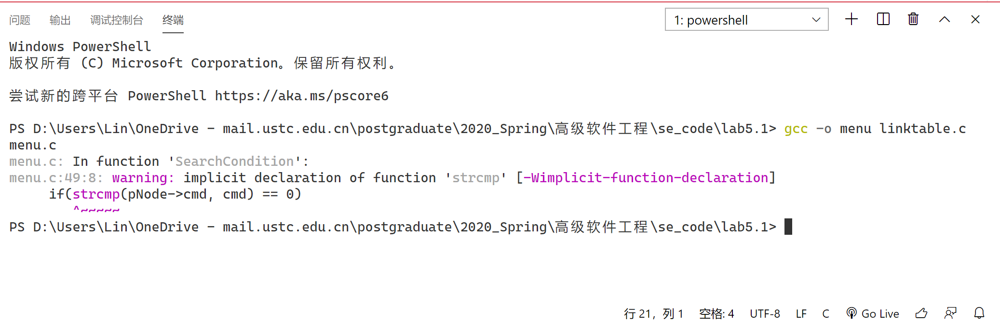
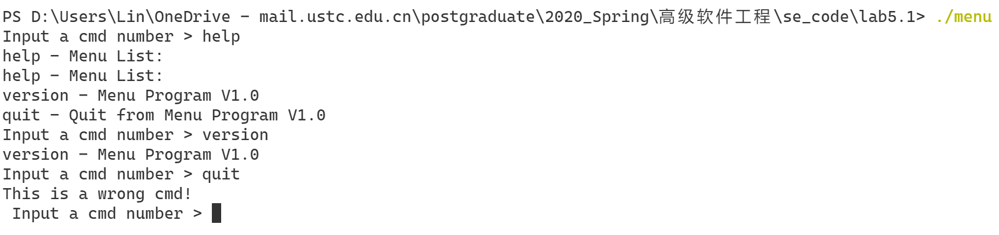
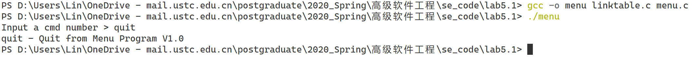
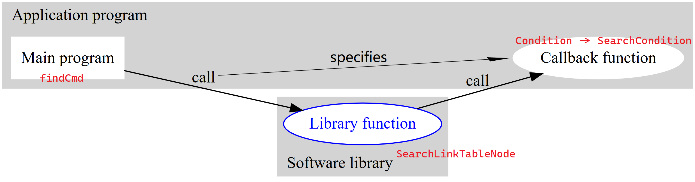

?> 工程化编程实战 callback 接口

作业要求


## VS Code 运行 lab5-1.tar.gz

> [!TIP]
> 附件地址： [lab5-1.tar.gz](https://pan.baidu.com/s/1pJ0qAIv)

安装、配置 MinGW

终端执行 `gcc -o menu linktable.c menu.c`，对 menu.c 进行编译和链接，输出警告



为 menu.c 添加头文件 `#include <string.h>`

再次编译和链接，打开 menu.exe 可以输入三个参数 `help`、`version` 和 `quit`，其中 `quit` 无法运行



## 找出 quit 命令无法运行的原因
找到输出 `This is a wrong cmd!` 的代码段，可知错误由 `p == null` 引起的，

```c
tDataNode *p = FindCmd(head, cmd);
if(p == NULL)
    {
        printf("This is a wrong cmd!\n");
        continue;
    }
```

而 `p` 由函数 `FindCmd()` 赋值，找到 `FindCmd()` 函数，函数体如下：

```c
/* find a cmd in the linklist and return the datanode pointer */
tDataNode *FindCmd(tLinkTable *head, char *cmd)
{
    return (tDataNode*)SearchLinkTableNode(head, SearchCondition);
}
```

`FindCmd()` 函数调用了 linktable.c 下的 `SearchLinkTableNode()` 函数，函数体如下：

```c
// 把 Condition 修改为了函数指针，更容易理解
tLinkTableNode *SearchLinkTableNode(tLinkTable *pLinkTable, int (*Conditon)(tLinkTableNode *pNode))
{
    if(pLinkTable == NULL || Conditon == NULL)
    {
        return NULL;
    }
    tLinkTableNode *pNode = pLinkTable->pHead;
    while(pNode != pLinkTable->pTail)
    {    
        if(Conditon(pNode) == SUCCESS)
        {
            return pNode;				    
        }
        pNode = pNode->pNext;
    }
    return NULL;
}
```

可见错误出现在这个函数中  
`SearchLinkTableNode()` 参数解释：
- `*pLinkTable`：所有命令都存在这个链表中。链表已在之前初始化
- `*Condition`：这是一个函数指针<span style="color: gray;font-size: 12px">写成 `Conditon` 应为笔误</span>。从 `FindCmd()` 中可看出，函数指针指向 menu.c 下的 `SearchCondition()` 函数，`SearchCondition()` 为回调函数

`SearchLinkTableNode()` 流程：
- 若 `命令链表为空` 或 `回调函数不存在`，返回 `NULL`
- `while` 循环遍历命令链表，`Conditon` 指向的函数用于字符串判等（判断命令链表中的字符串与输入字符串是否相等），若 `输入的字符串存在于命令链表`，返回 `与输入字串相等的这个结点`
- 否则返回 `NULL`

由上面分析可得，链表不为空 且 回调函数存在，所以错误出现在 `while` 循环。`while` 的终止条件为 `pNode == pLinkTable->pTail`（`pNode` 等于链表最后一个结点时终止），而从链表初始化函数（下方）中可看出，quit 刚好为链表最后一个结点，因此链表内的 quit 还没机会与输入命令进行比较就已经终止循环了

因此，修改循环条件为 `pNode != NULL`


```c
int InitMenuData(tLinkTable** ppLinktable)
{
    ...
    pNode->cmd = "help";
    ...
    AddLinkTableNode(*ppLinktable, (tLinkTableNode*)pNode);

    ...
    pNode->cmd = "version";
    ...
    AddLinkTableNode(*ppLinktable, (tLinkTableNode*)pNode);

    ...
    pNode->cmd = "quit";
    ...
    AddLinkTableNode(*ppLinktable, (tLinkTableNode*)pNode);
    return 0;
}
```

修改后的 quit 输出如下：



## 分析 callback 函数
如果你把**函数的指针（地址）** 作为**参数**传递给另一个函数，当这个指针（地址）被用来调用其所指向的函数时，我们就说这是回调函数

上述例子中 `*Condition` 作为参数，指针指向函数 `SearchCondition()`。因此，这个地址是被用来调用 `SearchCondition()` 的。我们称函数 `SearchCondition()` 为回调函数

维基百科中的图示：

