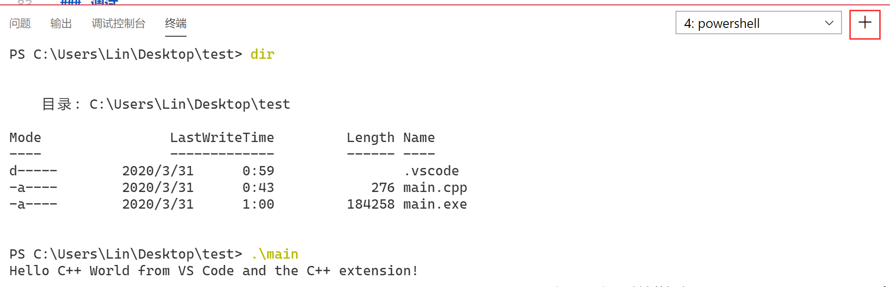
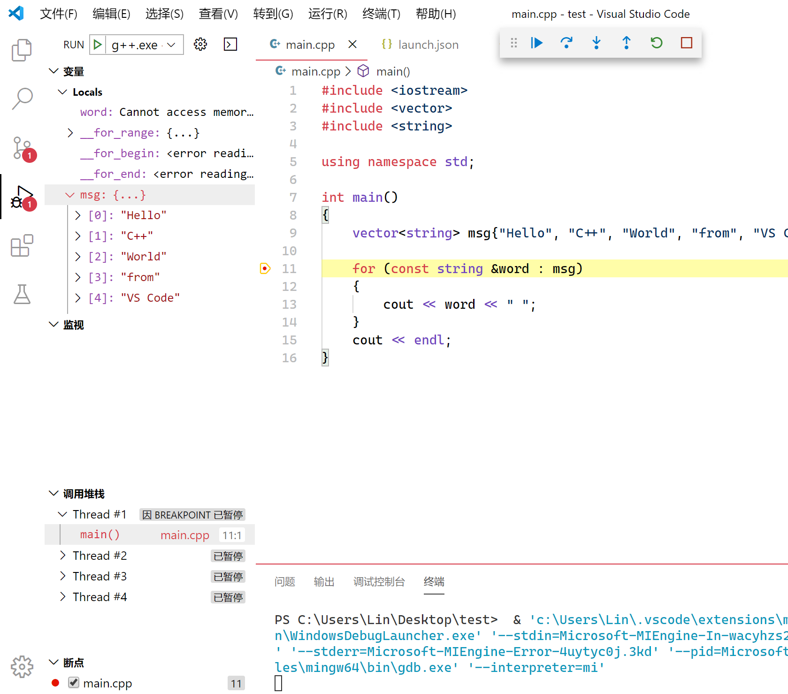

?> Windows 下基于 VS Code 的 C++ 编程语言的构建调试环境搭建指南

## 安装 GCC 编译器

>  安装 GCC 部分转载自：<a href="https://blog.csdn.net/u012278016/article/details/101101486" target="_blank">CSDN</a>

MinGW 是 GCC 在 Windows 下的编译环境，它托管于 SourceForge（<a href="https://sourceforge.net/projects/mingw-w64/files/" target="_blank">下载链接</a>）


1. 选择 x86_64-win32-seh 进行下载


2. 解压文件，并把 bin 文件夹添加到系统环境变量


3. 在命令行工具中运行 `gcc -v`，显示如下表示安装成功


## 配置 VS Code

> 配置 VS Code 部分参考 👉🏿 <a href="https://code.visualstudio.com/docs/cpp/config-mingw" target="_blank">官方教程</a>

### 创建工作区
新建文件夹，并 `通过 Code 打开` 将文件夹添加到工作区。也可以通过 `文件 - 打开文件夹` 将文件夹添加到工作区。


### 安装插件


### 写一个 Hello World

文件夹下新建 cpp 文件


写 Hello World

```cpp
#include <iostream>
#include <vector>
#include <string>

using namespace std;

int main()
{
    vector<string> msg{"Hello", "C++", "World", "from", "VS Code", "and the C++ extension!"};

    for (const string &word : msg)
    {
        cout << word << " ";
    }
    cout << endl;
}
```

### 编译 cpp 文件

我们将创建 `tasks.json` 任务文件来告诉 VS Code 如何构建（编译）程序。此“任务”将调用 g++ 编译器以基于源代码创建可执行文件。

从主菜单中，选择 **终端 > 配置默认生成任务...**。在弹出的菜单中，会列出 C++ 编译器的各种预定义的构建任务，选择 **g++.exe build active file**。


这会在 .vscode 文件夹中生成 `tasks.json` 文件。

#### 运行生成任务

按下 <kbd>Ctrl</kbd> + <kbd>Shift</kbd> + <kbd>B</kbd>，运行 `task.json` 中定义的任务。终端将显示编译器的输出，但输出是这样的


使用 **+** 按钮创建一个新终端，并运行刚刚生成的 exe 文件



### 调试

接下来将创建一个 `launch.json` 文件来配置 VS Code，以便在按 <kbd>F5</kbd> 调试程序时启动 GDB 调试器。从菜单中选择 **运行 > 添加配置...** 然后选择 **C++ (GDB/LLDB)**。


点击行号左边空白处，为程序打一个断点，再按 <kbd>F5</kbd> 启动调试，即可在左侧的运行视图看到调试信息。

