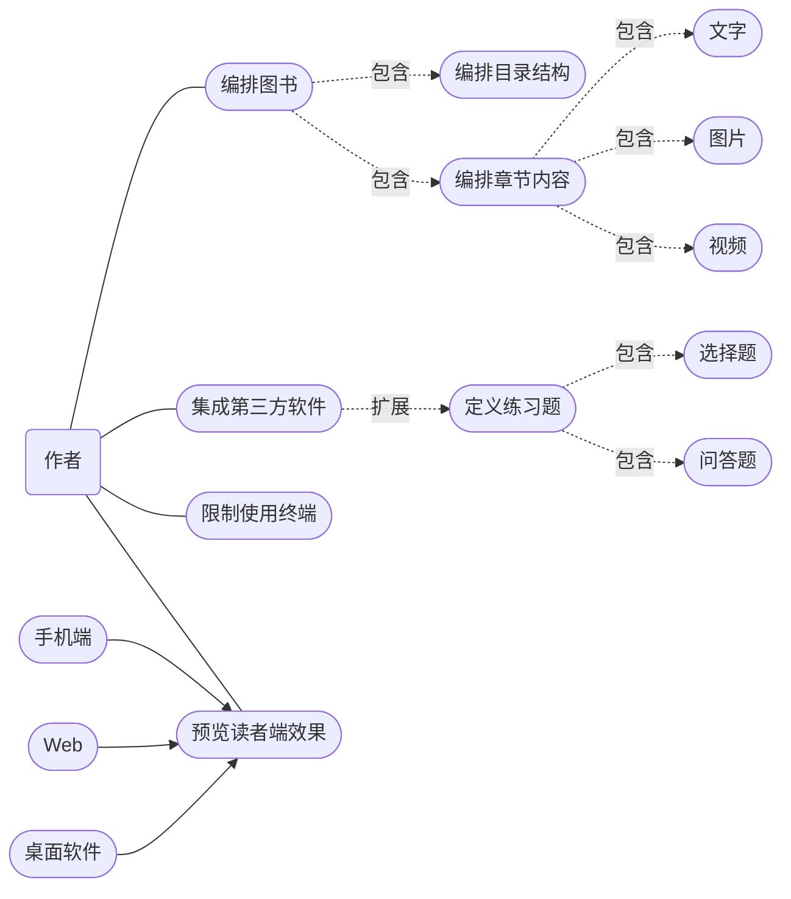
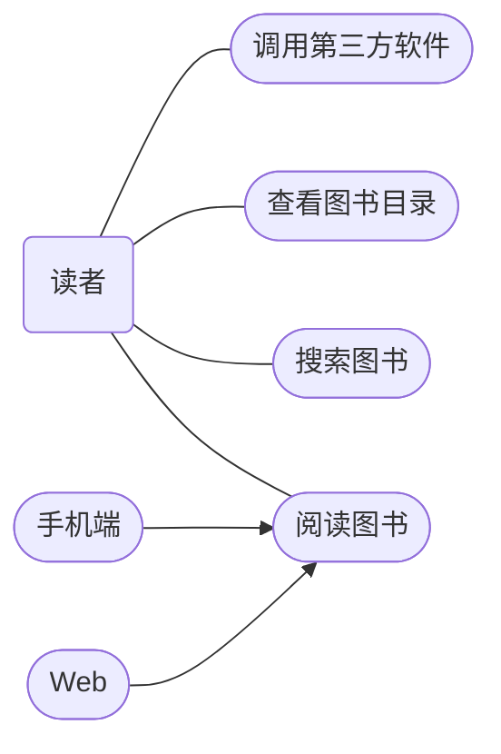
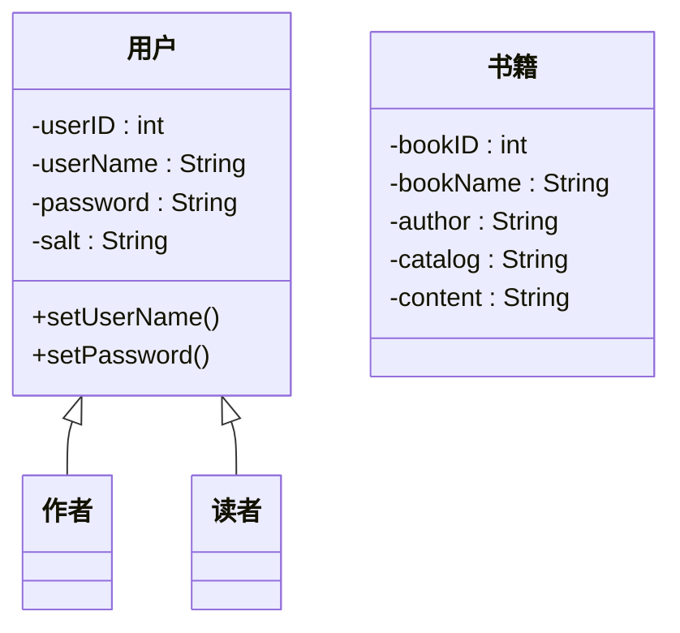
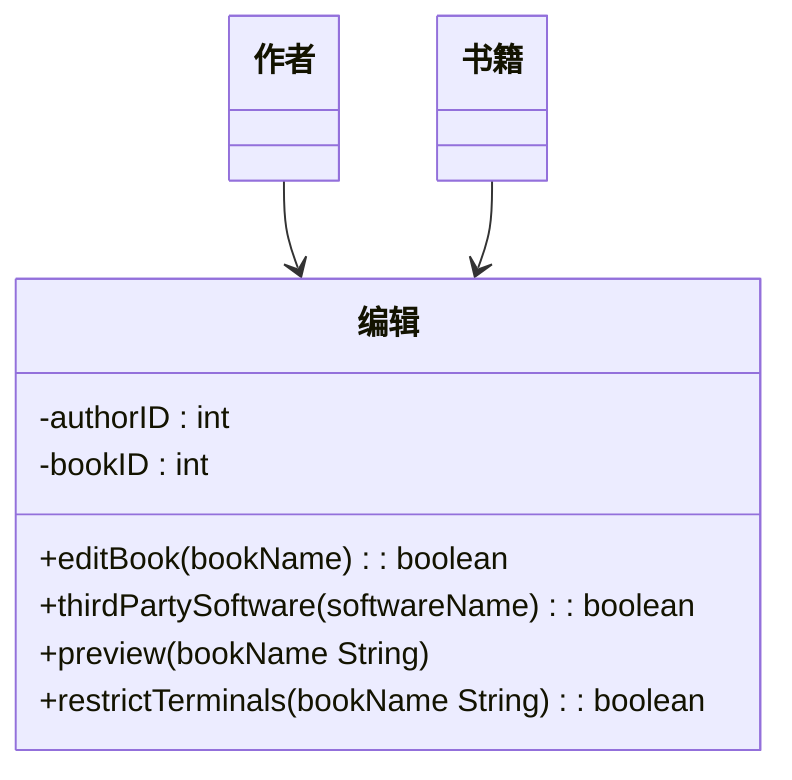
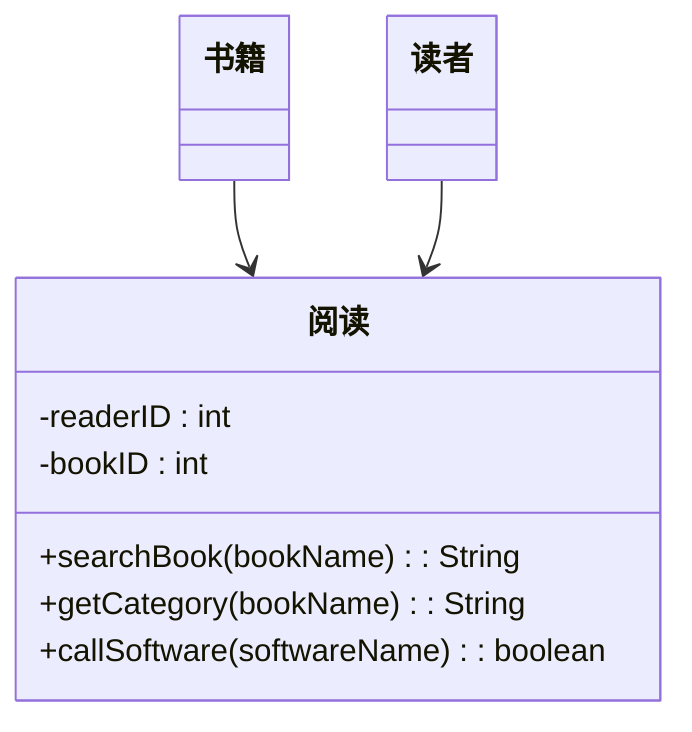
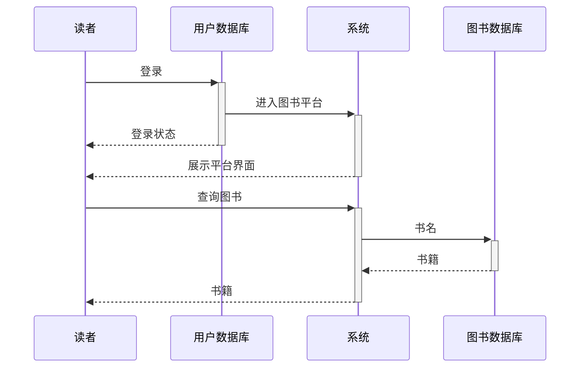
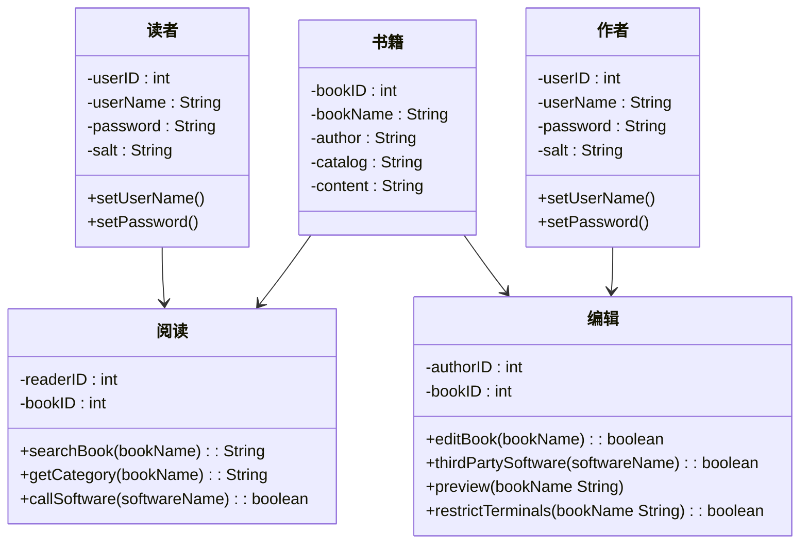

?> 交互式多媒体图书平台的设计与实现

作业要求：

> 参照码农的自我修养之从需求分析到软件设计——一种从需求分析到软件设计的基本建模方法，按如下交互式多媒体图书平台的需求，首先按需求类型分类，然后完成概念原型设计（应具有用例图 + 数据模型），并选择一个关键用例进行深入分析和设计（应具有分析和设计序列图），最终给出一个设计方案（应具有设计类图或者微服务架构图）。交互式多媒体图书平台的需求如下：
> 
> - 交互式多媒体图书平台包括读者端和作者端；
> - 作者可以编排图书的目录结构、章节内容，章节内容中包括图片、视频、文字、和集成第三方软件边学边练，能定义常见练习题比如问答题、选择题；作者编辑时可以预览读者端的效果，手机效果、Web 和桌面软件效果，作者可以限制只在某一种或几种终端上使用；
> - 读者端可以通过手机、浏览器或桌面软件使用交互式多媒体图书，可以搜索图书，查看图书目录，根据作者设定可以顺序解锁阅读，或随意跳跃阅读，或部分章节内部必须顺序阅读；
> - 软件能集成或调用第三方软件，比如阅读过程中能直接调出 VS Code 或 linux shell 等第三方软件进行实际操作，并对操作做基本正误判断，然后回到图书继续阅读。调出第三方软件应该通过统一的插件模型调用，第三方软件与图书之间的相互转换要自动流畅完成，不需要读者操作；
> - 读者端的手机 App、Web 或桌面软件使用统一的代码实现，优先考虑前后端为 JS + Node.js + MongoDB；作者端独立部署，只有在作者发布图书时才将数据导入到读者端系统，以避免作者端的操作对读者端系统的影响；
> - 以上需求的不足可以适当补充和调整。
> 
> 如果您有创新性的项目或者您实际的工程实践项目也可以作为本次作业的需求替代以上需求，但从需求分析到软件设计的基本建模方法的要求不变。

## 需求类型

有哪些类型的需求？
- 功能需求：根据所需的活动描述所需的行为
- 质量需求或非功能需求：描述软件必须具备的一些质量特征
- 设计约束：设计决策，如平台或界面组件的选择
- 过程约束：对可用于构建系统的技术或资源的限制

### 功能需求
#### 作者端

- 作者可以编排图书的目录结构、章节内容（章节内容中包括图片、视频、文字）和集成第三方软件边学边练（能定义常见练习题比如问答题、选择题）
- 作者编辑时可以预览读者端的效果，手机效果、Web 和桌面软件效果
- 作者可以限制图书只在某一种或几种终端上使用

#### 读者端

- 读者可以通过手机、浏览器或桌面软件使用交互式多媒体图书
- 读者可以搜索图书，查看图书目录，根据作者设定可以顺序解锁阅读，或随意跳跃阅读，或部分章节内部必须顺序阅读
- 软件能集成或调用第三方软件，比如阅读过程中能直接调出 VS Code 或 linux shell 等第三方软件进行实际操作，并对操作做基本正误判断，然后回到图书继续阅读

### 质量需求

质量需求主要关注**可用性、性能、安全性**三方面。

- 可用性：可用性关注于如何让用户简单容易的地实现他想要完成的动作。这样可以使用户快速地学习该系统的功能，高效地使用系统从而将错误最小化并且让用户对该系统有信心和满意
- 性能：交互式多媒体图书平台必须保证其性能，才能为用户提供正常可靠及时的服务，用户无法或者需要等待很久才能得到系统的服务，这必然会降低用户对该系统的评价，严重影响系统的质量。性能主要关注于响应时间
- 安全性：安全性是衡量系统在向合法用户提供服务的同时，阻止非授权使用的能力。多媒体图书平台必须阻止非授权的访问，而且为合法的用户提供服务。且平台涉及账号密码，个人资料等，如果系统安全性不高，易被外界破解，会使读者和作者的财产隐私受损

### 设计约束

- 读者端的手机 App、Web 或桌面软件使用统一的代码实现，优先考虑前后端为 JS + Node.js + MongoDB
- 作者端独立部署，只有在作者发布图书时才将数据导入到读者端系统，以避免作者端的操作对读者端系统的影响
- 调出第三方软件应该通过统一的插件模型调用，第三方软件与图书之间的相互转换要自动流畅完成，不需要读者操作

## 概念原型设计

### 用例图

#### 作者

#### 读者

### 数据模型

系统的实体类有用户和书籍，用户分为作者和读者。用户和书籍之间的关联类有编辑和阅读。

 

## 关键用例分析和设计

以读者查找书籍的过程为例，画出以下设计序列图

## 设计类图

