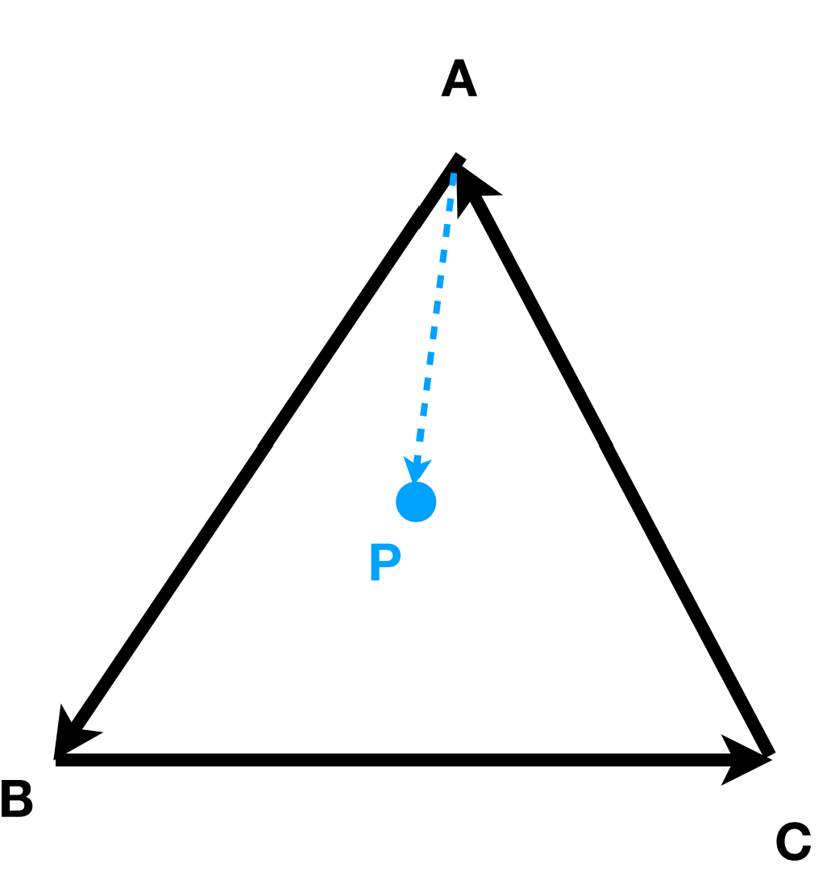

## 向量

- 图形学中默认向量形式为列向量
- 向量的点乘多用于计算两个向量的夹角以及一个向量在另一个向量上的投影长度
- 右手定则找出叉乘方向（闫老师提到可以用右手螺旋定则：若 $\vec{c} = \vec{a} \times \vec{b}$ ，那么从 $\vec{a}$ 旋转到 $\vec{b}$，大拇指方向即为 $\vec{c}$ 方向），可以看出叉乘并不满足交换律
- OpenGL 为左手坐标系：$\vec{x} \times \vec{y} = -\vec{z}$
- 可通过向量叉乘判断一个点是否在三角形内部.如下图，若三次叉乘的结果方向相同，则在三角形内部。具体见视频的 39:24

## 矩阵

- 矩阵乘法无交换律，有**★结合律**和分配律