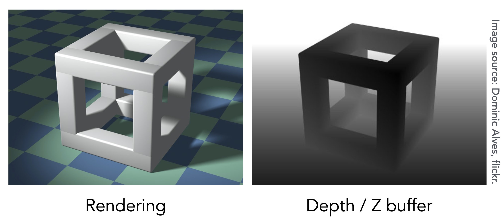
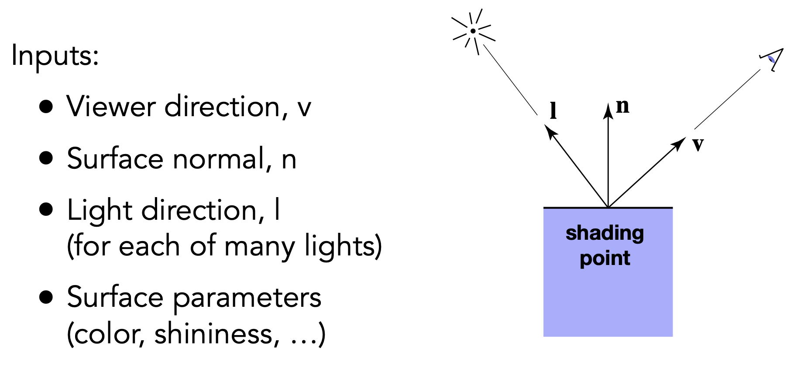
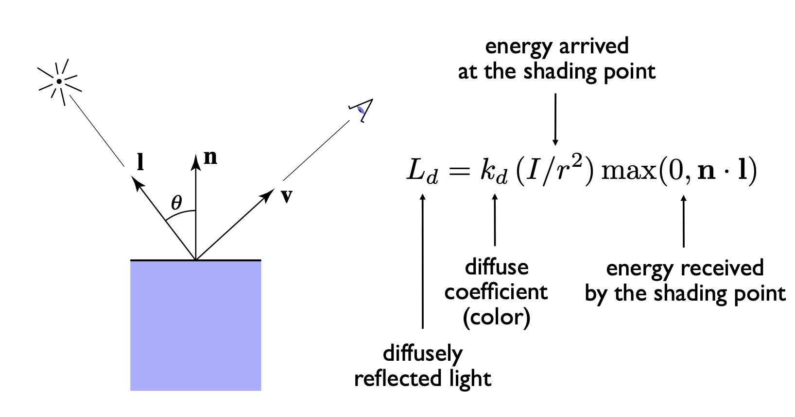
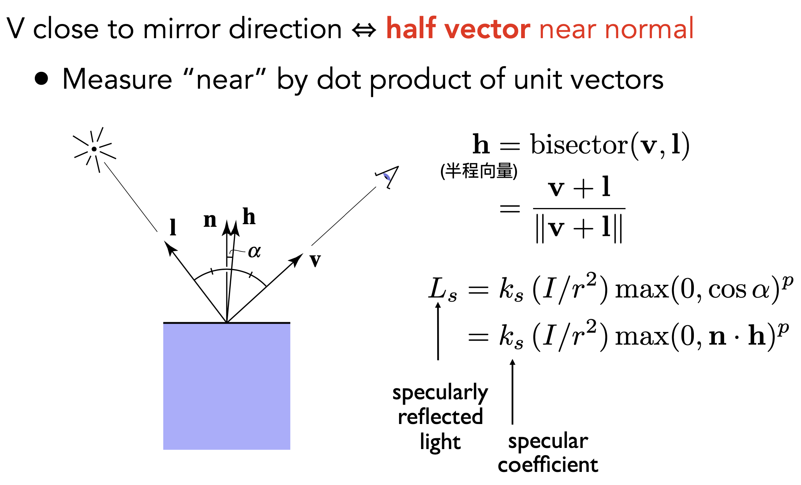
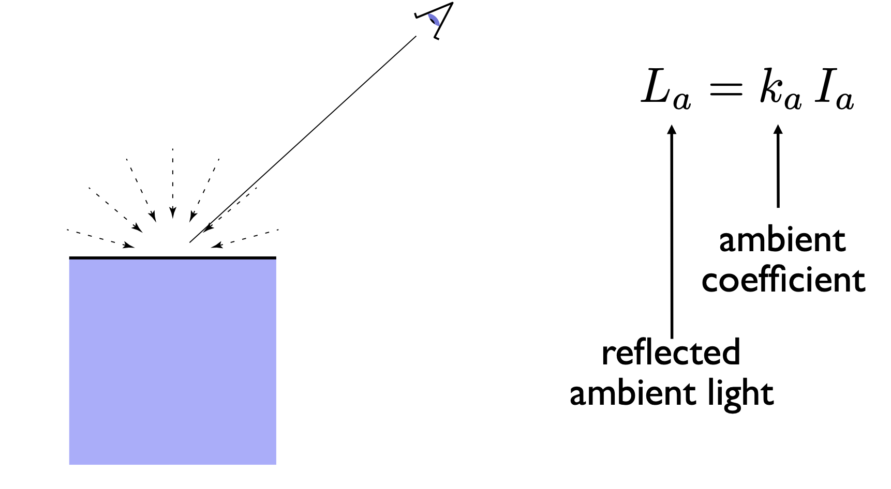
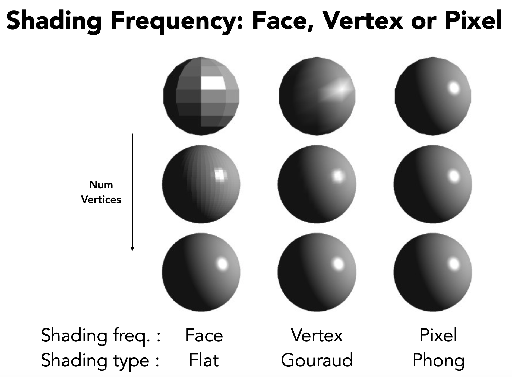
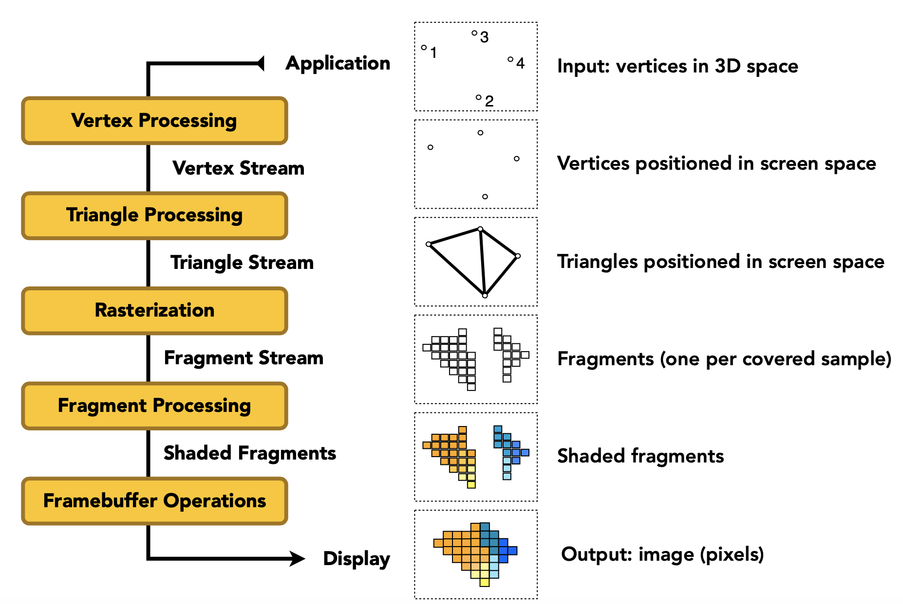
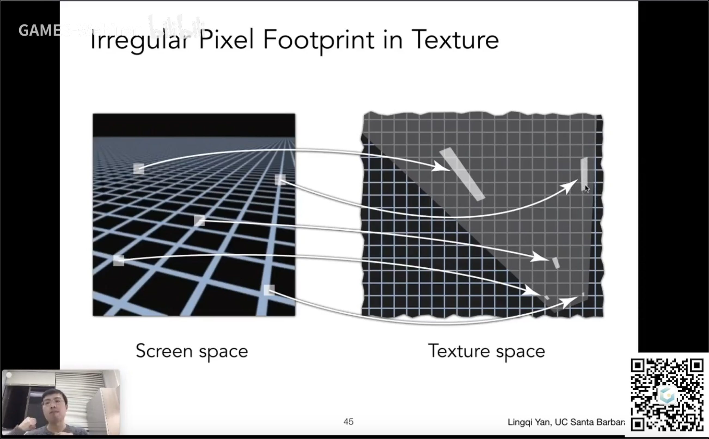

- 可见性/遮挡
  - 深度缓冲（Z-Buffering）
- 着色
  - 光照和着色（Illunmination & Shading）
  - 图形渲染管线（Graphics Pipeline）

## 画家算法 vs 深度缓冲

深度缓冲的思想：
- 为每次采样（每个像素）存储最小的深度值
- 需要一个额外的缓冲来记录
  - 帧缓冲（frame buffer）存储每一个像素的颜色的值
  - 深度缓冲（z-buffer）存储每一个像素的深度值（假设 z 为正，且 z 越小离相机越近）

```cpp
for (each triangle T)
    for (each sample (x, y, z) in T)
        if (z < zbuffer[x, y])       // closest sample so far
        {
            framebuffer[x, y] = rgb; // update color
            zbuffer[x, y] = z;       // update depth
        }
        else
        {}                          // do nothing, this sample is occluded
```



> [!TIP]
> 深度缓冲无法处理透明物体

## 着色

- 在图形学中，着色定义为：将材质应用于物体的过程
- 着色有局部性，不考虑阴影
- Blinn-Phong 反射模型
  - 漫反射
  - 镜面反射
  - 环境光



### 漫反射

- 光线向各个方向均匀散射
- 对于一个漫反射着色点，从任意角度看亮度都是一样的（和观测方向无关）

> [!NOTE|label:着色点接收的光线能量]
>
> 
>
> 因此，着色点接收的光线能量和 $cos<光线方向, 着色点法向量>$ 成正比

> [!NOTE|label:光衰减]
> 光在真空中传播没有能量损失。如下图，假设在某一时刻，从点光源发出的光的终点可以围城一个球，那么在每一个球壳上的能量是相同的。假设在半径为 $1$ 的球壳上的每一点的光的强度是 $I$，那么在半径为 $r$ 的球壳上，每个点的光线强度是 $I/r^2$（球表面积公式：$S = 4 \pi r^2$）。
>
> 
>
> 因此，距离越远，光照强度越弱。

最后，漫反射光照模型如下：



$L_{d}=k_{d}\left(I / r^{2}\right) \max (0, \mathbf{n} \cdot \mathbf{l})$


### 镜面反射

观察方向和光反射方向越近，观察到的镜面反射效果越强。




$\begin{aligned} L_{s} &=k_{s}\left(I / r^{2}\right) \max (0, \cos \alpha)^{p} \\ &=k_{s}\left(I / r^{2}\right) \max (0, \mathbf{n} \cdot \mathbf{h})^{p} \end{aligned}$

- 镜面反射方向和观察方向接近时，会有高光现象，但**高光会随角度变化迅速衰减**，所以要给高光项 $\cos \alpha$ 加 $p$ 次方
  
- 半程向量定义如上图，引入半程向量的原因是反射向量计算代价较大，因此用 $\max(0, \mathbf{n} \cdot \mathbf{h})$ 代替 $\max(0, \mathbf{R} \cdot \mathbf{v})$

### 环境光

物体有些部分不直接被光源照亮，但却不是暗的，这就是环境光的影响，Blinn-Phong 模型直接将环境光设置为一个常数（来自四面八方的环境光强度一样），真实的环境光计算很复杂。



$L_{a}=k_{a} I_{a}$

离得远就暗是另一种现象，Blinn-Phong 模型是经验模型不考虑**物体到观察点**的距离。

Blinn-Phong 模型最终效果：


$\begin{aligned} L &=L_{a}+L_{d}+L_{s} \\ &=k_{a} I_{a}+k_{d}\left(I / r^{2}\right) \max (0, \mathbf{n} \cdot 1)+k_{s}\left(I / r^{2}\right) \max (0, \mathbf{n} \cdot \mathbf{h})^{p} \end{aligned}$

### 着色频率

- Flat shading（逐面着色）
- Gouraud shading（逐顶点着色）
- Phong shading（逐像素着色）



如果面出现的频率已经很高了，那 flat shading 也有比较好的效果，如上图左下角。

- 顶点的法线就是相邻各个面的法线的加权平均
  
- 像素的法线需用到重心坐标，后续会讲

### 图形管线

图形管线如下：（这一阶段可以多看几遍闫老师的视频）



在 [shadertoy](https://www.shadertoy.com/) 中可以编写着色器并查看效果。


Shader program

### 纹理映射


#### 重心坐标 -> 插值

定义：给定三角形的三点坐标 $A, B, C$，该平面内一点 $(x,y)$ 可以写成这三点坐标的线性组合形式，即 $(x,y) = \alpha A+\beta B+ \gamma C$ 且满足 $\alpha + \beta + \gamma=1$ 则称此时 3 个坐标 $A, B, C$ 的权重 $\alpha, \beta ,\gamma$ 为点 $(x,y)$ 的重心坐标。

> https://blog.csdn.net/qq_38065509/article/details/105446756

- 任意一点的的重心坐标可以**通过该点与三角形顶点连线分割出的三个子三角形**的面积比计算出来
- 投影下不能保证重心坐标不变，要在三维空间里利用重心坐标插值
- 纹理坐标、法向量、颜色等等都可以用来插值


像素在三角形 -> 计算对应 uv -> 取纹理对应颜色值 -> 设置

#### Texture Magnification

纹理太小怎么办 -> 插值

- 纹理像素：texel
- 解决：
  - Nearest
  - Bilinear
    - Bilinear 插值 lerp
    - 水平 + 竖直插值 -> 双线性插值
    - 最近的四个点插值
  - Bicubic 双向三次插值
    - 周围 16 个点做三次插值
    - 运算量更大，结果更好

#### Texture Magnification

> 关于这部分，闫老师的课件比较详细

纹理太大怎么办

- 一个 pixel 对应多个 texel -> 采样频率不足导致摩尔纹或锯齿（走样）
- 解决：
  - Supersampling
    - 太浪费！
    - Just need to get the average value within a range
        - Point Query vs. **(Avg.) Range Query**
  - Mipmap（显存额外开销 1/3）：对正方形区域（屏幕空间一个像素对应纹理像素的正方形区域）查询结果较好
  - 各向异性过滤（显存额外开销 3 倍）：对长方形区域（屏幕空间一个像素对应纹理像素的长方形区域，下图最右边的那对映射）效果很好
  - EWA 过滤

